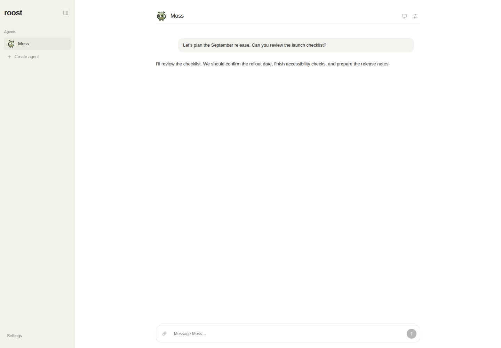
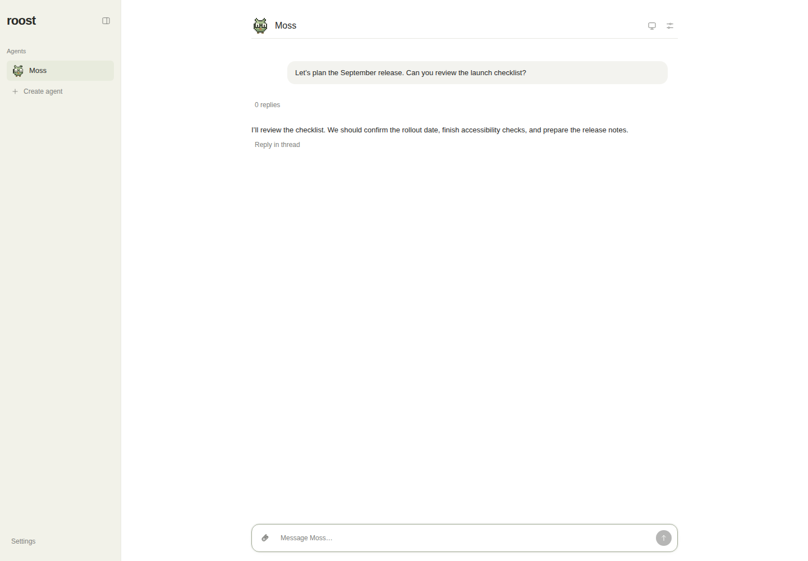
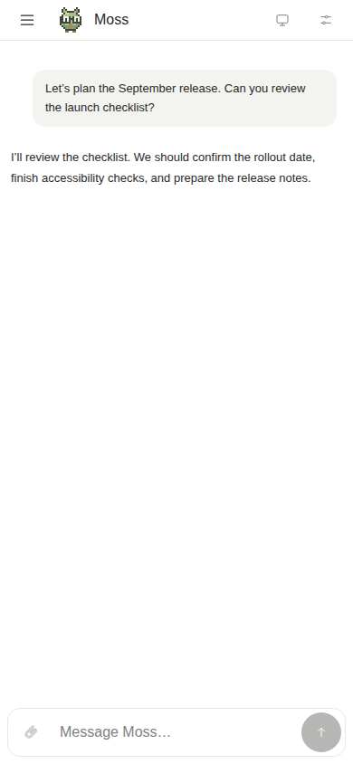
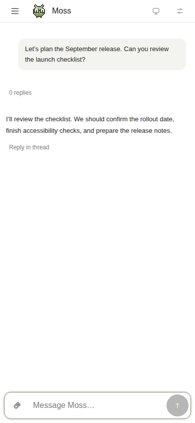
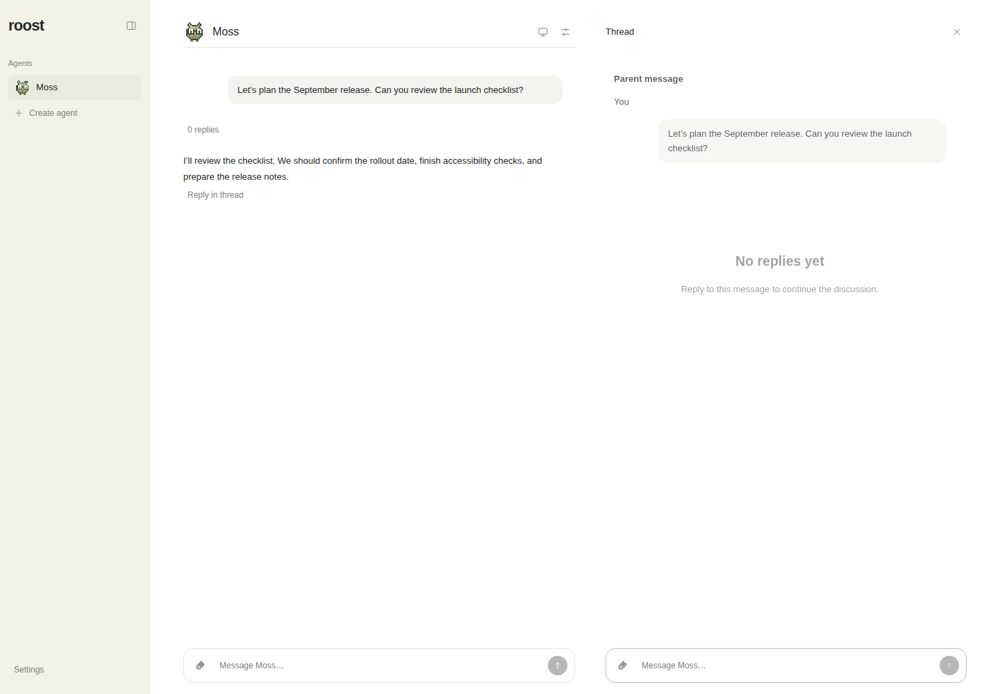
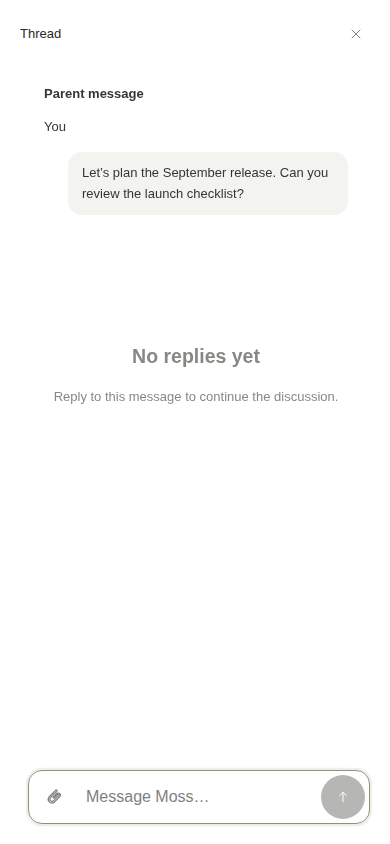

# Message threads — review evidence

Actual rendered Roost UI and actual Chromium recordings using synthetic local data and a simulated Codex JSONL provider. No live conversations or account data were captured. Recordings visibly label the fixture. This branch contains review artifacts only and is not intended to merge into the application.

## Matching main-conversation captures

Same fixture messages, empty composer, light theme, scale 1. Desktop: 1440×1000. Mobile: 390×844.

| Viewport | Before | After |
| --- | --- | --- |
| Desktop |  |  |
| Mobile |  |  |

## Thread views

| Desktop side panel | Mobile full screen |
| --- | --- |
|  |  |

## Recordings

Download the MP4 files to play them. All use H.264 and retain their matching viewport dimensions.

| Flow | Desktop | Mobile |
| --- | --- | --- |
| Open/reply, streamed response, attachment reload, switch/reopen/unread, runtime retrieval of newer main and sibling decisions | [Desktop fixture recording](interactions-desktop-fixture.mp4) | [Mobile fixture recording](interactions-mobile-fixture.mp4) |
| Long-history link/scroll isolation, active child, visibly queued main, cancellation in origin | [Desktop queue recording](queue-active-desktop-fixture.mp4) | [Mobile queue recording](queue-active-mobile-fixture.mp4) |

The [manifest](manifest.json) records dimensions, durations, sizes, and SHA-256 hashes. Failed and unfinalized capture attempts are excluded.

Mobile is Linux Chromium viewport emulation. Physical devices, Safari/iOS keyboards, real screen-reader operation, and real push-service delivery were not tested. The browser harness checks keyboard focus, labels, and overflow; mobile controls use the existing 44-pixel button targets. Provider responses are simulated; runtime routing and tool calls execute through the actual application.
