# Shared agent note — rendered review evidence

Task Work summary and fixture-only captures for the shared-agent-note PR stack
in `srctl/roost`: [backend #20](https://github.com/srctl/roost/pull/20), then
[editor #21](https://github.com/srctl/roost/pull/21).
No production agents, notes, accounts, or user data are shown. Capture helpers,
raw logs, and recordings are kept out of the source PR branches.

## Matched before / after

Both states show the same Moss conversation, theme, viewport, and fixture text.
Before is current main `7415789`; after is the shared-note implementation at
`ff2b82b` (backend foundation `9ef6e8e`). The
new Note destination did not exist before, so its editor views are labeled as
additional after-only evidence rather than a fabricated before view.

| Viewport | Before — Chat | After — Chat |
| --- | --- | --- |
| Desktop, 1440 × 1000 | 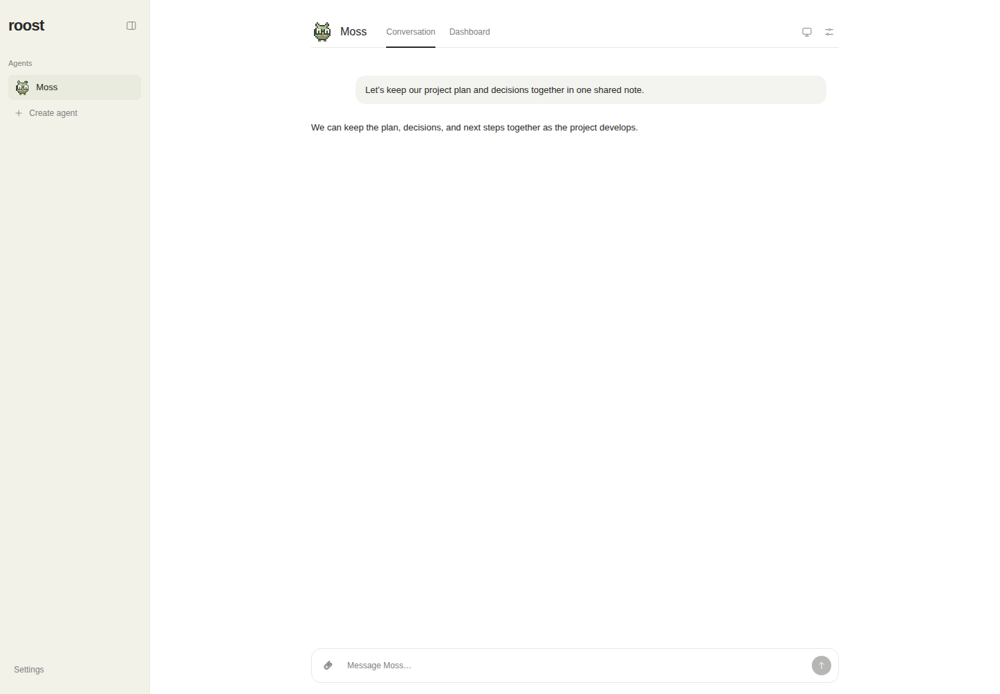 | 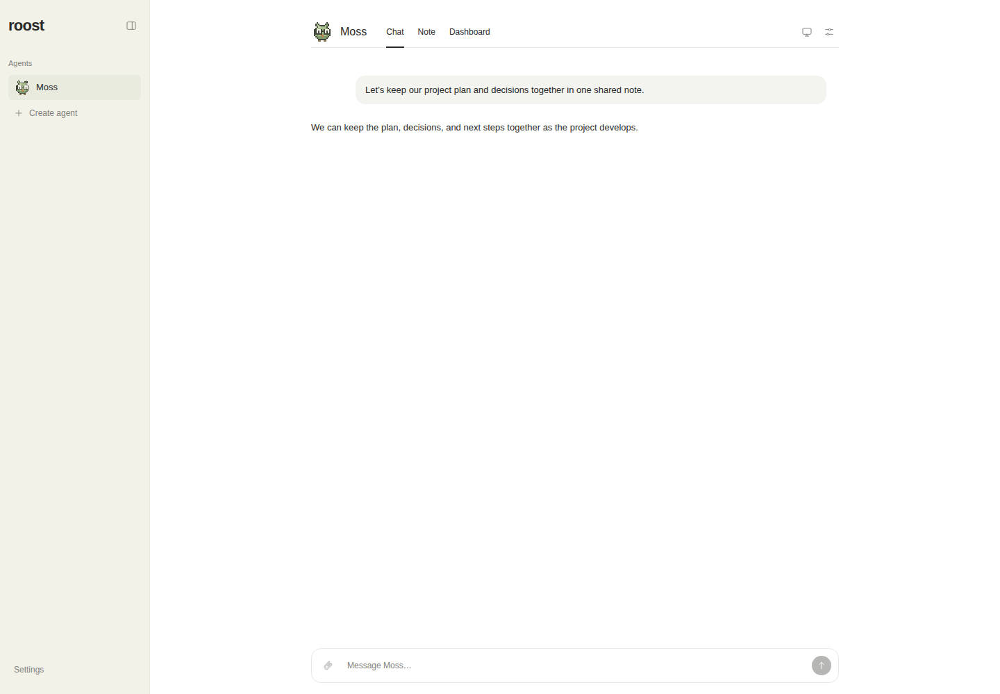 |
| Mobile, 390 × 844 | 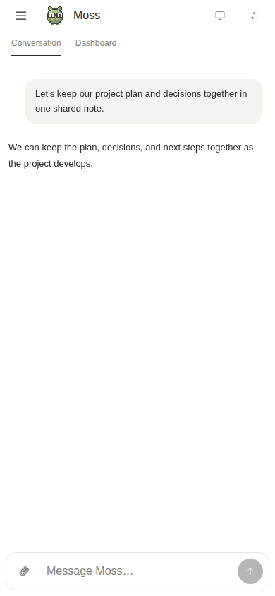 | 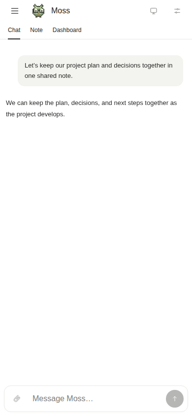 |

## Short recordings

- [Desktop walkthrough (MP4)](desktop-walkthrough.mp4)
- [Mobile walkthrough (MP4)](mobile-walkthrough.mp4)

Each actual browser recording demonstrates opening Note; `## ` → H2; slash
insertion with `/todo`; selection formatting (bold, italic, safe link); an
interactive todo; maintenance instruction editing; autosave and reload;
an update through the real agent tool handler preserving the user's block and
identity; an overlapping user/agent conflict with a refused merge, draft
download, and explicit reload; and offline draft recovery after reload. The
mobile recording also exercises a 390 × 480 viewport to simulate keyboard
occlusion. Recordings preserve timing and viewport, with only MP4 encoding added.
Text selection is set through the browser DOM and formatting controls are then
clicked/tapped; native mobile selection handles are not represented.

## Additional after views

| State | Desktop | Mobile |
| --- | --- | --- |
| Saved rich note | 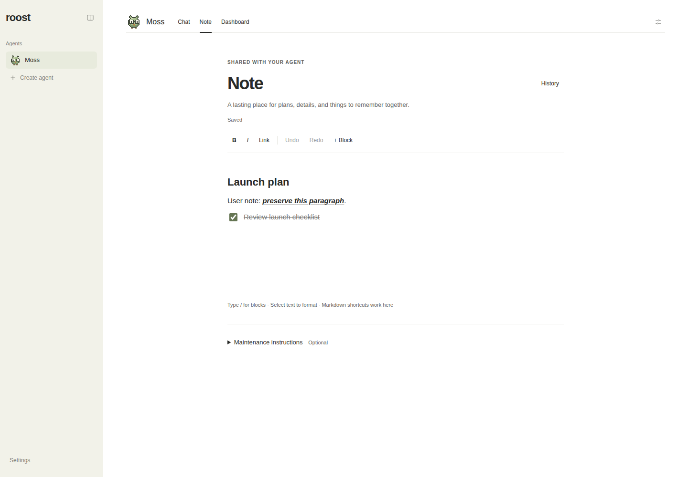 | 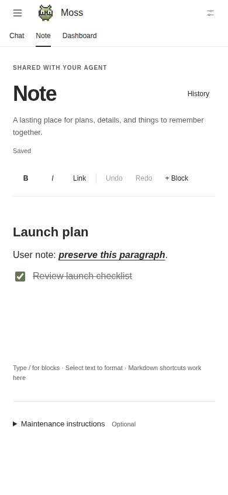 |
| Slash menu | 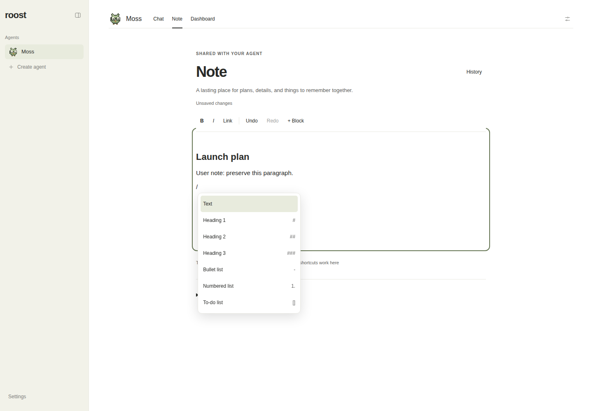 | 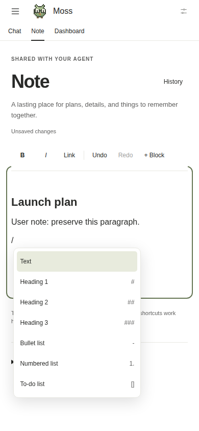 |
| Selection formatting | 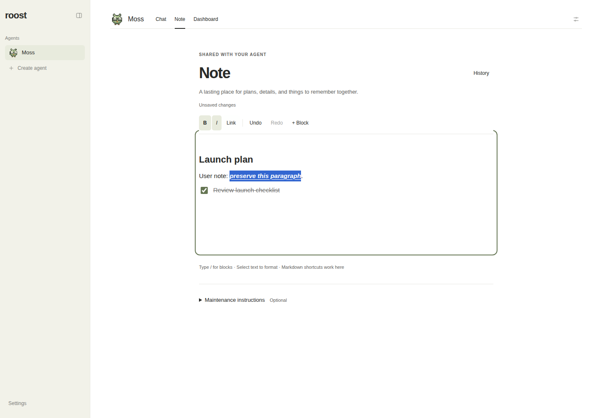 | 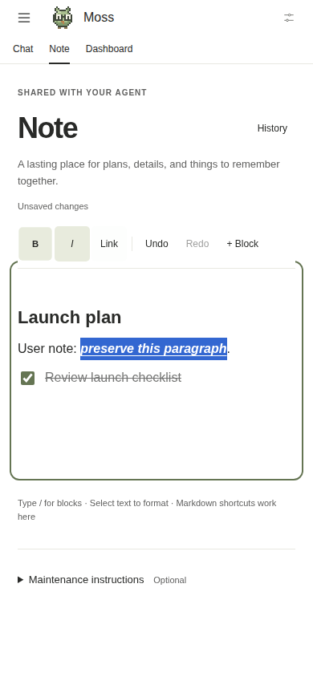 |
| Maintenance instructions | 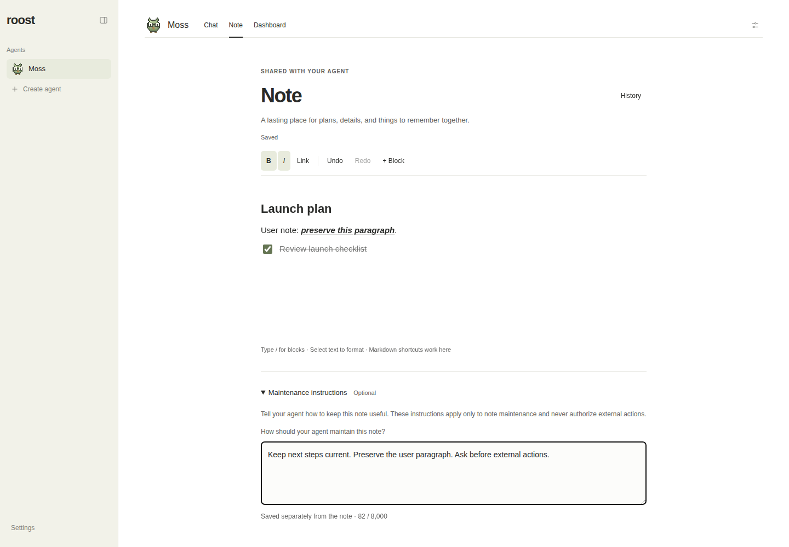 | 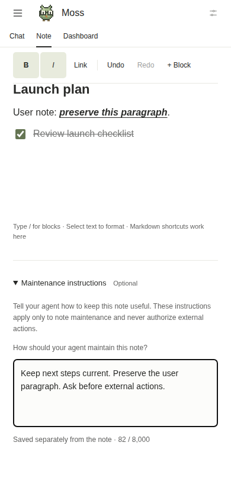 |
| Same-block conflict | 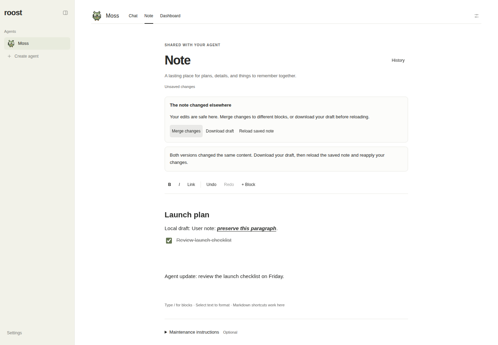 | 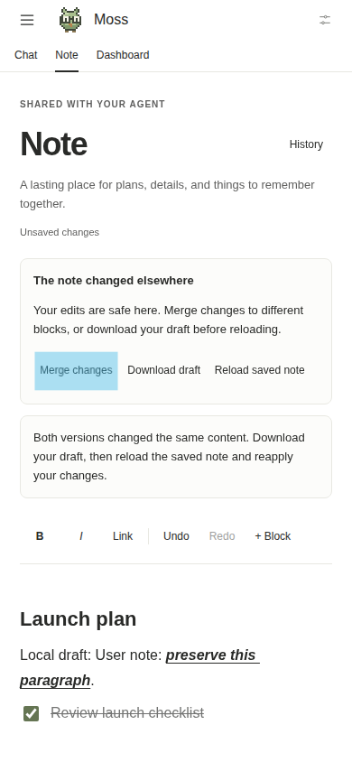 |

[Mobile reduced-height editing view](after-mobile-keyboard-height.png).

## Verification and limitations

The desktop and mobile browser runs passed all recorded interactions. Additional
checks passed for `# `, `## `, `### `, `- `, `1. `, and `[] ` shortcuts; undo/redo;
click/touch block insertion; Escape restoring link-entry focus; hostile rich
paste stripping scripts, unsafe URLs, and copied IDs; failed POST retry;
safe different-block reconciliation; and revision restore. A separate regression
confirmed that remote adoption resets local undo, so Ctrl+Z cannot remove the
agent's update. No browser page errors were recorded in the final walkthroughs.

Axe found no violations on the mobile note. Desktop findings are limited to
three unchanged sidebar contrast issues (Agents, Create agent, Settings); no
note-surface violations remained. The region rule was excluded because the app
shell is outside this note-focused check.

These are Chromium desktop and mobile-emulation checks with real rendering.
Physical iOS/Android virtual keyboards, native mobile selection handles, and
screen readers were unavailable and are not claimed as tested. Capture itself
was not blocked. Review the source PRs for automated tests, build results,
editor licensing, and measured bundle cost.

## Automated validation

Backend commit `9ef6e8e`: typecheck and 165 tests passed independently.
Full stack `ff2b82b`: `pnpm check` passed (167 tests, production auth smoke,
application/CLI builds, site typecheck, 6 site tests, and site builds).
The final check used `umask 022` and cleared the inherited `ROOST_CODEX_BINARY`
for test fixtures. The auth harness now explicitly supplies its temporary Nitro
port so it does not inherit the host application port.

Final built-app smoke passed desktop and mobile, light and dark, with zero
note-surface axe violations, no horizontal overflow, one main landmark, and no
browser page errors. Desktop recording: 39 seconds; mobile recording: 33 seconds.

## Handoff

Both source branches are pushed and PRs #20 and #21 are open and mergeable.
The task-owned implementation pane and fixture servers are stopped. Disposable
build/dependency directories have been removed after verification.
The coordinator must remove the clean task worktree after this assignment exits:
the active assignment Herdr/Codex processes still use that directory, so removing
it during handoff would violate the no-active-worker cleanup condition. No merge,
deployment, Notion update, or Roost task update was performed.
