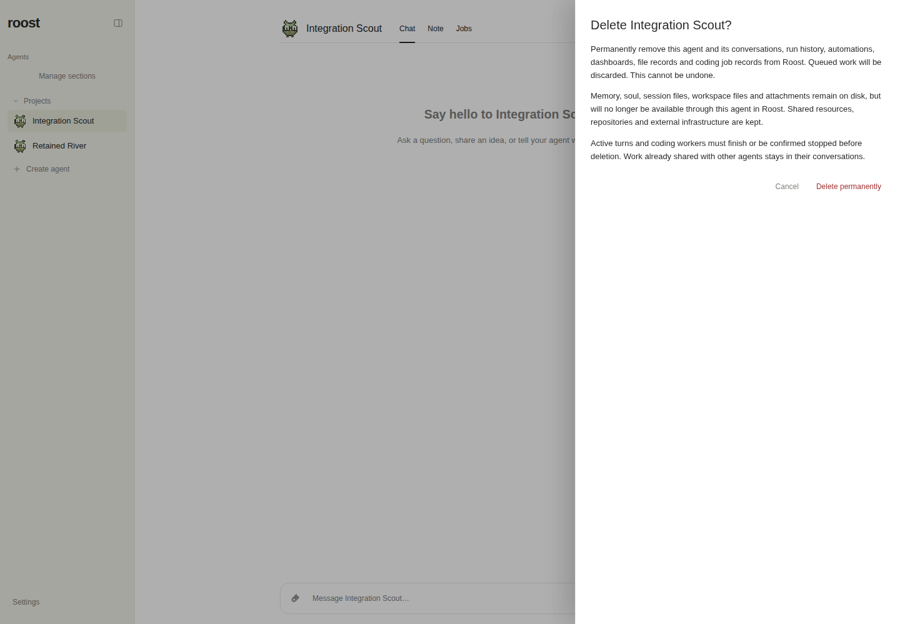
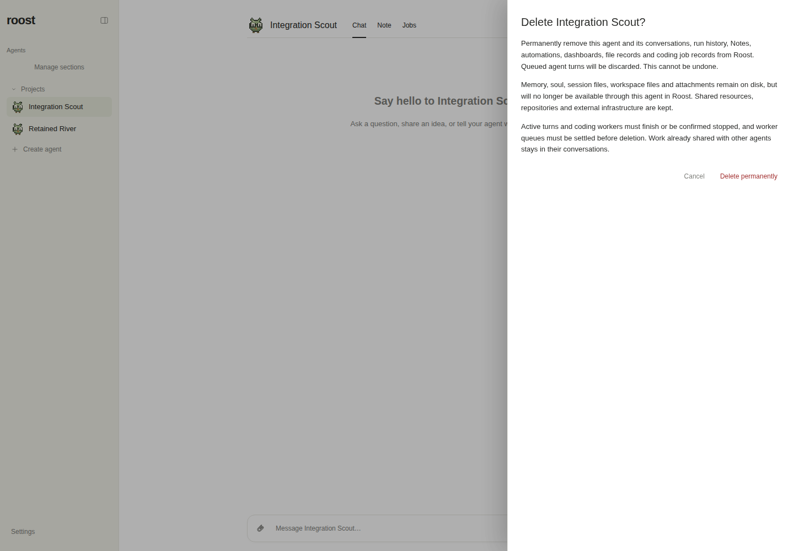
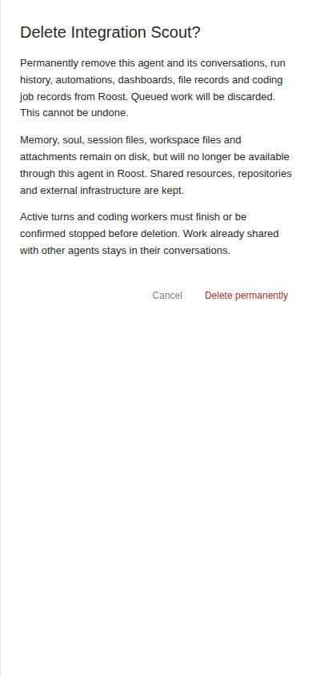
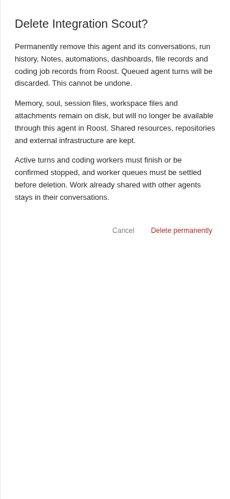
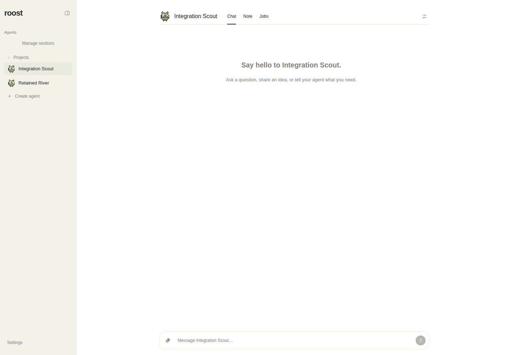
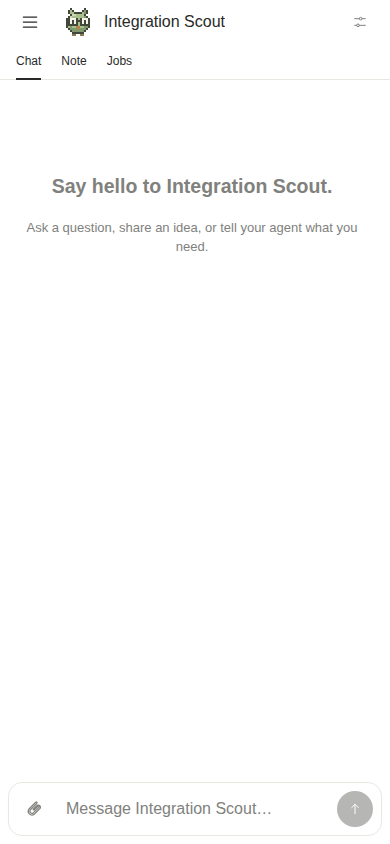
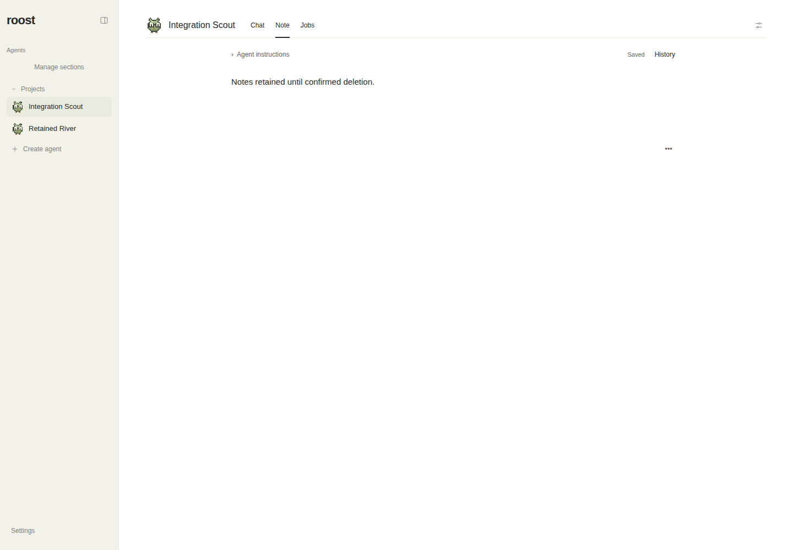
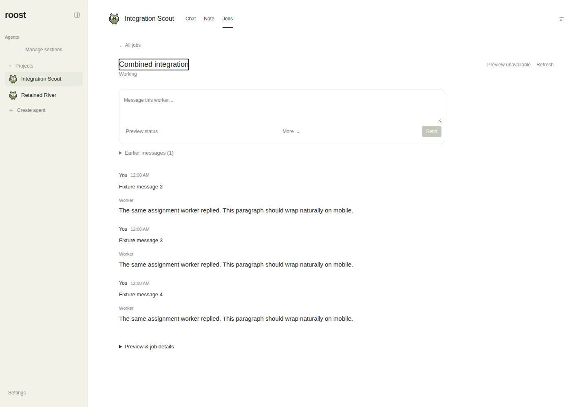
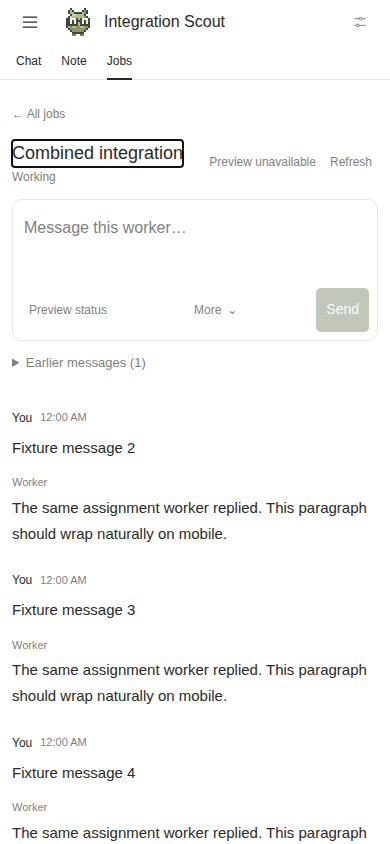

# Verified integration: approved PR12, PR36, PR37

Source integration commit: `6ce913f6f779296e237cf4f3abd4b032fe76943a`.
Tested source tree: `8669a57d7a3b0241fc1048727bd3e2c2bd4a2a0c`.

All three PRs are merged. Final main is `820d28226fee5bb91b0c7ba12d5a88d845df2fd0`, with exactly the tested tree above. Only these approved features are combined. See HANDOFF.md for exact checks, merge records, preserved previews, and cleanup.

## Matched rendered confirmation-copy comparison

Same final production fixture, agent, light theme, state, reduced motion and viewport. **Before is a reconstructed rendered copy baseline:** only the two confirmation paragraphs use the exact approved PR12 text; after restores the final integration text. This is not a screenshot of a separate historical build. Both are real browser-rendered screenshots, not image mockups. The comparison JSON files record the exact text and method. Original historical feature before/after images remain in each original PR.

| View | Before: original PR12 copy in final layout | After: integrated copy |
| --- | --- | --- |
| Desktop 1440×1000 |  |  |
| Mobile 390×844 |  |  |

The final text names Notes removal and distinguishes discarded queued agent turns from worker queues that must settle before deletion. Disk retention remains unchanged.

## Final production rendering

All application data and workers shown below are synthetic browser fixtures. These images prove UI behavior and styles, not live model answers.

| Route | Desktop | Mobile |
| --- | --- | --- |
| Chat / navigation |  |  |
| Notes |  |  |
| Direct job conversation |  |  |

[Queued worker input blocks deletion despite a terminal job label](mobile-terminal-queued-deletion-blocked.png). [Home after permitted synthetic deletion](mobile-after-fixture-deletion.png).

Jobs checks cover widths 320, 390, 430 and 1440; drafts/reload, restored focus, secondary navigation, polling, history disclosure, natural paragraphs and no overflow. Shortened viewports and visualViewport checks are Chromium emulation, not physical iOS/Android or Safari verification.

## Actual worker exchange

Passed; recorded separately in `live-exchange-result.json`: two actual replies, exactly two submissions, an idempotent retry, ordered busy-queue behavior, and unchanged terminal identity. Herdr did not expose a native session ID, so native-session continuity is not independently claimed. It uses a fresh isolated database and the task's actual Herdr/Codex/Astra implementation worker. The occupied managing conversation is a synthetic database row, not a live managing-model turn. Existing PR37 evidence retains its earlier live occupied-manager proof. No preserved review worker receives a new message.
