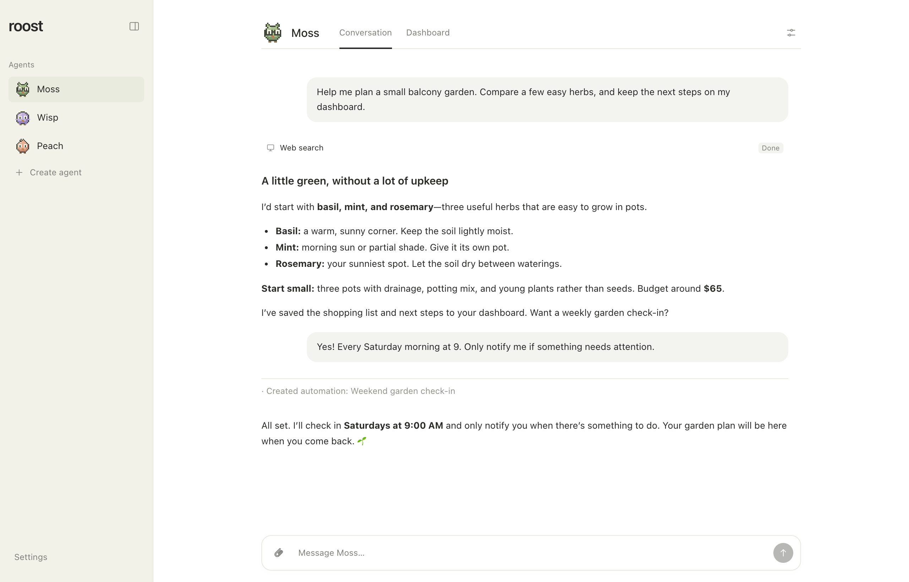
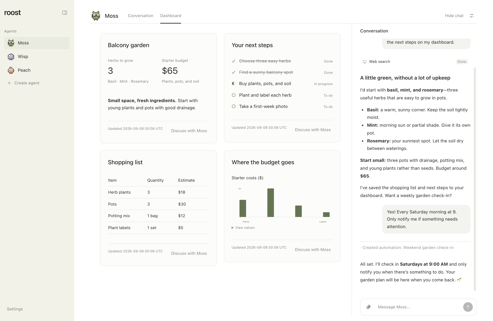
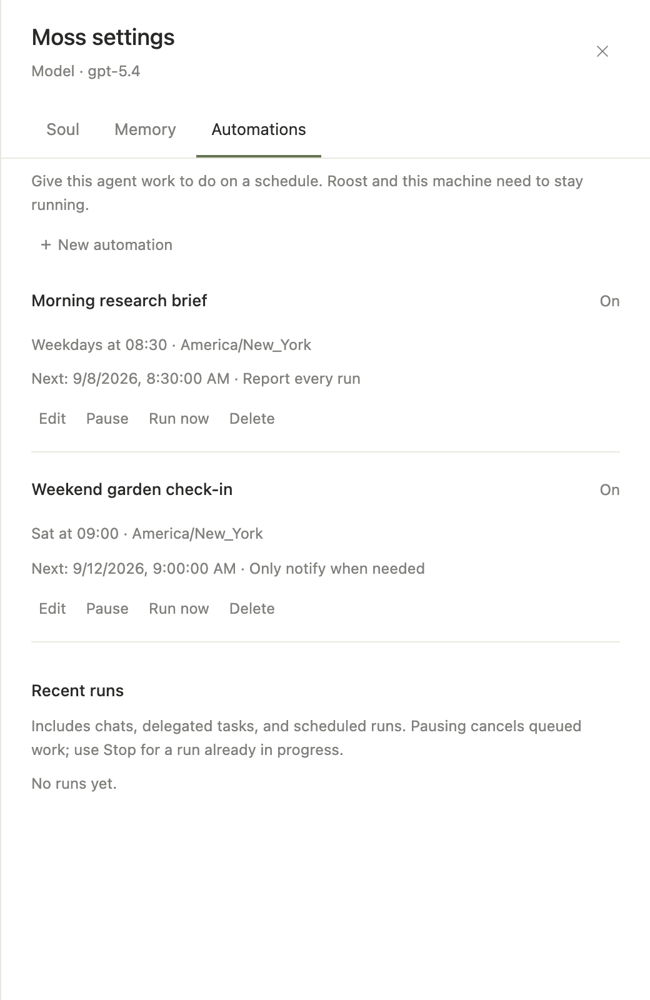
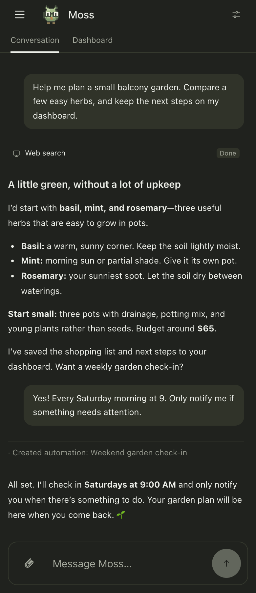

# Roost

**A home for persistent AI agents and their work.**

Roost is a self-hosted app for agents with a purpose, a conversation, and work to
come back to. Connect Codex, create your agents, and give each one a job. Talk
with them, schedule recurring tasks, and pick up where you left off from your
computer or phone.

[Get started](#get-started) · [Features](#what-you-can-do) · [Screenshots](#a-look-around) · [Documentation](docs/index.md)

*The real Roost interface, shown with fictional sample conversations and data.*

## What you can do

- **Give every agent a role.** Choose a name, character, model, and instructions.
  Each agent keeps its own conversation, workspace, soul, and Codex memory.
- **Put recurring work on autopilot.** Schedule briefings, checks, and follow-ups
  in chat or the automation editor. Review runs, pause schedules, or run a task
  now. Work continues with the browser closed while Roost and its host are running.
- **Let agents work together.** An agent can delegate part of your request to a
  specialist and bring the result back into the original conversation.
- **Work with files.** Attach documents and images, receive downloadable results,
  and approve prepared actions in the conversation.
- **Share a computer.** On a configured Linux desktop, watch an agent use the
  signed-in browser and take control when you need to.
- **Turn conversations into dashboards.** Enable agent-maintained notes, metrics,
  tables, charts, and task lists, with a conversation pane alongside your results.
- **Take your agents with you.** Use the mobile layout in light or dark mode, add
  Roost to your phone's home screen, and enable push notifications for results
  or approvals.

Roost is built for one person running their own agents. Conversations, settings,
files, and agent memory are stored on your host. Agents use Codex and any
connected services to do their work; this is not an offline model runner.

## A look around

### A workspace that grows with the conversation

Ask an agent to keep a tracker, plan, or report up to date. Dashboards give that
work a home, and the side-by-side chat keeps changes one conversation away.

### Scheduled work, wherever you are

Create recurring tasks and choose whether to hear about every run or only when
something needs attention. Pick up the same conversation on your phone.

| Automations | Mobile · dark mode |
| --- | --- |
|  |  |

Learn more about [dashboards](docs/dashboards.md), [automations](docs/automations.md),
and [mobile access](docs/mobile.md).

## Get started

The packaged installation supports **Linux x64 with systemd** and includes its
own Node and Codex runtimes.

1. Follow the [installation guide](docs/install.md) to install a release and open
   Roost through a local connection or SSH tunnel.
2. Open **Settings → Connect Codex** and complete sign-in.
3. Choose **Create an agent**, give it a purpose, and send your first task.

The [getting started guide](docs/getting-started.md) walks through your first
agent. For other platforms or a source checkout, see [development](docs/development.md).

Choose a host in the [deployment guide](docs/deployment.md), including exe.dev,
Linux servers, macOS, Railway, and Vercel for the public websites. Working with
an agent? Start with [agent-readable docs](docs/for-agents.md); the published
docs site provides `/llms.txt`, `/llms-full.txt`, and a Markdown URL for every guide.

Enable [native passkey login](docs/authentication.md) for a public HTTPS address,
or keep using SSH or an authenticating proxy such as exe.dev. Passkeys are opt-in;
existing private-proxy installations work unchanged.
Agent memory is kept separately, but agents share the host and connected
accounts; they are not isolated operating-system users.

## Learn more

- [Documentation](docs/index.md)
- [Agents and memory](docs/agents-and-memory.md)
- [Automations](docs/automations.md) and [delegation](docs/delegation.md)
- [Files and approvals](docs/files-and-approvals.md)
- [Shared computer](docs/computer.md), [dashboards](docs/dashboards.md), and [mobile access](docs/mobile.md)
- [Development](docs/development.md) and [architecture](docs/architecture.md)

Source and releases: [srctl/roost on GitHub](https://github.com/srctl/roost).
Roost is available under the [MIT license](LICENSE).
