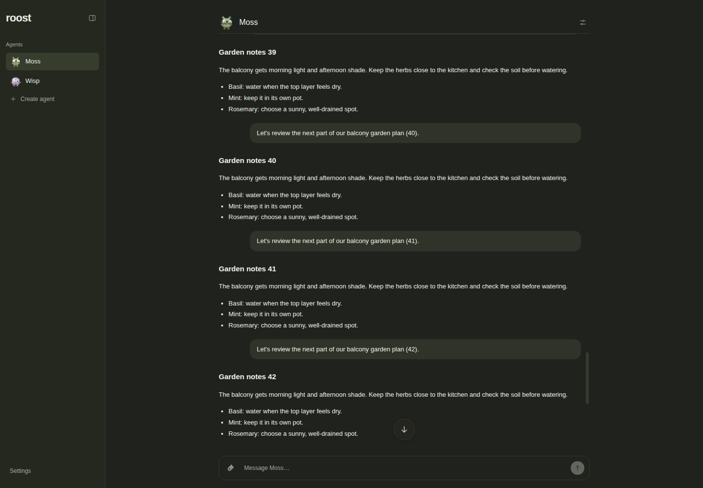
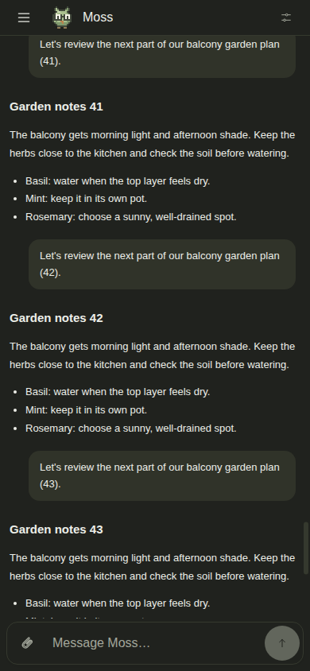
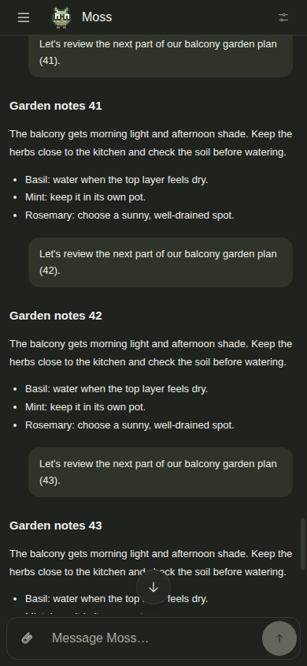

# Bottom of chat button

For the follow-up stacked on custom themes PR2, see the
[theme compatibility checks and matched screenshots](../chat-bottom-theme-evidence/README.md).
The evidence below documents the original button implementation.

When the reader is more than half the visible history viewport away from the
bottom, a circular “Scroll to bottom” button appears 12px above the history's
bottom edge, above the composer and any approval/error controls. Its hit area is
44 × 44px on desktop and mobile. The threshold is
`distance > Math.max(64, viewport.clientHeight / 2)`, keeping the existing 64px
reply-follow boundary separate from the button's visibility threshold.

Activation jumps immediately to the latest content, resumes following replies,
and transfers focus to the history viewport because the button disappears. The
native button supports Enter, Space, mouse and touch. The immediate jump respects
reduced motion; the existing sending animation still uses the shared motion
behavior. Content and viewport resize observations update visibility, including
streamed content, delayed layout changes, and composer resizing. Existing keyed
conversation mounts reset the state on agent switches.

## Rendered before and after

Actual isolated Chromium captures of the production build, with fictional local
fixture data: Moss has 90 alternating messages; Wisp has a short thread. Dark
mode, reduced motion, identical route, empty composer, viewport, and scroll
position within each pair. Baseline captured from `3f7bae2` before source edits.
No live Roost data or signed-in browser session was used.

| Viewport | Before | After |
| --- | --- | --- |
| Desktop — 1440 × 1000 |  |  |
| Mobile — 390 × 844 |  |  |

The desktop history viewport is 845px tall, at scrollTop 5206, 676px from the
bottom in both captures. Mobile is 733px tall, at scrollTop 6733, 586px from the
bottom in both captures. Additional light-mode captures exercise a multiline
composer: [desktop](after-desktop-light.png), [mobile](after-mobile-light.png).

## Verification

- `pnpm check`: passed lint, typecheck, all 138 regression tests, application and
  CLI builds, production auth smoke, all six docs-site tests, site typecheck and
  marketing/docs builds. The check process used a clean environment and umask
  `022`; this VM defaults to `077`, which otherwise fails the existing packaging
  test's expected executable permissions. Loopback access was allowed for the
  repository's fixture integration tests.
- Chromium assertions passed on desktop (normal motion) and mobile (reduced
  motion): hidden initially/near the bottom; hidden at 49% and visible at 51%
  viewport distance; Enter, Space and click reach the latest content; focus moves
  to history; 44px target clears the composer; streamed edits preserve manual
  position and follow after activation; manual scrolling stops following;
  loading older messages preserves anchoring; switching to short history and
  back resets state; composer growth preserves placement; light/dark rendering;
  no horizontal overflow or browser page errors.
- Additional mobile touch assertions passed: a new message crosses the visibility
  threshold without a scroll event while preserving the reader's position;
  tapping reaches the bottom; subsequent new messages follow automatically;
  resizing the viewport recalculates visibility.
- `git diff --check`: passed.

The fixture scripts, assertion logs, and full check log are retained under
`.roost/chat-bottom-evidence/` in the assignment workspace for coordinator review.
Browser checks used simulated mobile Chromium; physical iOS/Safari keyboards and
installed PWA behavior were not tested.
