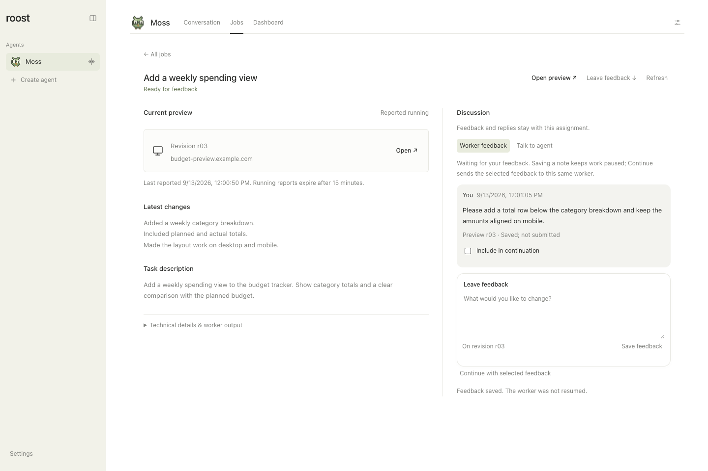

# Coding job workspaces

Open **Jobs** under a coding agent, then choose an assignment to see its preview,
latest changes, verification notes, PR links, and discussion. Jobs stays available
when dashboards are off. To configure a project or start an assignment, see
[Coding agents](coding-agents.md).

*Saved feedback stays with the assignment until you choose to continue. Real Roost interface with fictional sample data. Select the image for full size.*

## Inspect the result

Choose **Open preview** when the coordinator has reported a running preview.
Preview status is a report that expires after 15 minutes, not a live health check.
An expired report becomes **Preview status unknown**; **Try last preview** lets
you try its saved address. A stopped preview does not stop or complete the job.

When the coordinator marks work ready for review with PR links and verification
notes, **Review PR** becomes the main action. Completed jobs offer **View PR**.
Read the verification and integration status before deciding the work is ready:
these are the coordinator's recorded findings, not an independent CI guarantee.

## Save feedback and continue work

1. Open **Worker feedback**, describe the change, and choose **Save feedback**.
   The note records the preview revision you reviewed. Saving alone does not
   send a message to the worker or restart paused work.
2. Select the saved notes you want to send using **Include in continuation**.
3. Choose **Continue with selected feedback** when the existing worker is ready.
   Roost sends the selected notes to that same assignment and worker.
4. Check the delivery status alongside the notes. Failed or uncertain delivery
   needs inspection and a fresh explicit instruction; it is not silently replayed.

Continuation stays unavailable while the worker is busy or has a terminal
blocker. Resolve approval prompts in the worker's terminal. **Stop job** requests
an interruption and preserves the session and work; it does not undo changes or
delete infrastructure.

## Talk through the assignment

Choose **Talk to agent** for a conversation with the coordinating agent about
this job. Its replies, workspace updates, and notifications stay with the
assignment. Talking does not automatically submit saved worker feedback. An
explicit request in this job discussion can authorize further work; an unrelated
main-conversation message does not release a job's feedback pause.

Bookmark the job's URL to reopen its workspace. Job discussions are separate
from [reply threads](message-threads.md), but both can retrieve relevant context
from the same agent's conversations. Start additional assignments in the agent's
main conversation.

The **Review**, **Try**, and **Overview** controls choose a Juxi-authored handoff.
Review emphasizes changes, verification and PR links. Try emphasizes the current
preview and saved feedback. Overview keeps the worker discussion first. The
suggested view follows the current job state; manual choices survive reopening.
Status, errors and Stop remain visible in every view, and switching views preserves
drafts. See [adaptive views](juxi.md) for the shared web/SwiftUI contract.

## Durable state and authorization

`coding_job_workspaces` stores a revisioned preview URL/current revision/reported
availability, workflow (`working`, `feedback`, `review`), latest changes, PR links,
verification evidence and independent integration verification. Execution remains
in `coding_jobs`. Stopped or unavailable previews never complete/cancel jobs.
Availability is a timestamped report with a **15-minute lease**, not a health
check. Only `roost_report_coding_workspace` renews `previewReportedAt` and
`previewExpiresAt`; unrelated workflow writes do not. Missing, future-dated,
overlong or expired leases display **Unknown** and lose the running primary
CTA. A clearly labeled **Try last preview** link preserves discovery. The UI
rechecks time every second even if refresh fails; returning to a tab rechecks it.
Known offline state suspends route refresh so the app’s auth revalidation cannot
replace the workspace with a network error. Failed job reads retain the last
loaded list with an error; this is not an offline mutation queue.
The workspace read API also returns the effective `previewStatus`. No arbitrary
URL fetching, auth bypass, background model polling or preview infrastructure
control is introduced. HTTP(S) links reject embedded credentials and executable
schemes. A preview can fail before its lease expires; “Reported running” is not
an uptime guarantee. A later confirmed report restores that indication.

The coding coordinator reads `roost_get_coding_workspace` and writes
`roost_report_coding_workspace` within the existing active-run/job authorization.
A feedback pause requires an idle/review worker with no pending input. Worker
polls preserve the separate pause, and autonomous coding-result runs cannot
continue, complete or clear that pause. A newer explicit user turn in that job discussion or
Jobs continuation can resume. An unrelated main/sibling turn cannot release it. A review report requires PR URLs and nonempty
verification evidence; this is a coordinator assertion, not a CI attestation.

Saved feedback is an existing timeline notice, linked through
`coding_job_feedback` (IDs, preview revision, timestamp, delivery association).
Saving does not enqueue a chat run, steer a conversation or send worker input.
Saved feedback lives only in the job's conversation. “Worker feedback” keeps
selection and delivery receipts compact; “Talk to agent” uses the existing
`Conversation` component, scoped chat API, native session and run queue. That
chat can discuss the task without submitting saved feedback automatically.
Replies, workspace updates and notifications stay in the job conversation;
notification URLs reopen it using the existing conversation query. No parallel
message store or new agent identity is introduced.

Explicit continuation sends selected, previously unsent feedback through the
existing `coding_job_inputs` dispatch path. The transaction checks agent/job
ownership, current job revision, ready worker identity, unique selected IDs,
existing submissions and request-ID/content collisions. UI continuation cannot
retry an initial launch or answer terminal approvals. The core worker still
verifies ownership before dispatch. Assignment, brief, workspace and session IDs
are preserved; no new job is created. Subsequent polls expose queued/sent/failed
status. Failed or uncertain submissions are never silently replayed. The user
must inspect a failed delivery and provide a fresh, explicit instruction if
needed. UI request IDs/drafts survive reload in per-job session storage; server
receipts remain durable after that browser state is gone.

## Thread and migration boundaries

Reply threads and Jobs workspaces shipped together in v0.1.41. The workspace
migration depends on the conversation storage shipped in that release.

Each job owns a `conversation_records` entry keyed by its existing job UUID,
without a manufactured parent message. This is a job conversation, not a nested
reply thread. The original `sourceRunId`, assignment, request, workspace and
worker/native-session identity remain unchanged, including for jobs originating
in reply threads. New coding-report runs and notices target the job UUID;
completed historical reports retain their old provenance. New job sessions get
the assignment and bounded same-agent context as quoted context, and use
`roost_read_conversations` for main/sibling awareness. A job conversation cannot
launch another job, modify execution settings or act on a different job.

Capability version 14 refreshes native coordinator sessions from thread-stack
v13 so the workspace tools are available; archived messages keep their IDs.
This is independent of schema versions and never replaces a coding worker.

Core migrations 11–13 are the dependency's original migrations. Feature-keyed
`coding_workspace_versions` v2 runs after them: it creates conversation records,
moves only known saved-feedback messages and queued report notices, reroutes
queued report runs, and binds workspace metadata. It preserves message IDs,
positions, feedback delivery associations, job/run/worker identities and
historical results. Preflight refuses an active old coding-report turn before any core schema change,
with an actionable error; finish or stop those turns on the old runtime before retrying.
The feature transaction rolls back on collision or failure. Never run old and
new workers against the same upgraded store or downgrade this database.
Tombstones fence new feedback/chat/continuation and suppress new report wakeups;
worker state and the user's Stop control remain available without resurrecting
the discussion.

`apps/web/tests/coding-discussion.test.ts` exercises actual chat-worker replies and
notification routing with the local fake provider, shared-context retrieval,
same-job pause release, tombstones, bounded report expiry and repeatable
core-v10/v13 + workspace-v1 upgrades. It also tests the active-report upgrade
fence and queued routing without replay. Existing thread migration, routing,
provider/session, notification and coding identity regressions run in the same
aggregate. All test stores are disposable, with no live data or real workers.

## Development preview

The fixture in `apps/web/tests/fixtures/jobs-preview/` renders the real Jobs route with
sample assignments, simulated worker updates, and a fake Codex provider. Its
Vite configuration requires newly seeded temporary storage and refuses live
storage. Use it only for development and screenshots, never for deployment.
The production build uses the real Herdr transport.

## Direct conversation with the existing worker

The default **Talk to worker** tab sends a durable user message straight to the
existing job's dispatch queue. It does not enqueue a managing-agent chat run or
wait for its conversational slot/review checkpoint. The separate **Talk to
agent** and saved feedback views remain available. Drafts and request IDs survive
reload in per-job session storage; receipts and responses live in the existing
job timeline. `coding_worker_messages` holds only receipt/identity associations
and the terminal baseline used to isolate a response, sharing
`coding_job_inputs` with coordinator continuations. Additive workspace migration
v3 creates those associations and fences older runtimes from opening that store.

Herdr's documented prompt operation does not accept a busy worker, so this uses
an ordered, bounded queue (20 pending inputs per job), never claims immediate
interruption, and dispatches direct messages only at an observed idle/done
boundary. The original session/native identity is checked again by the transport.
A delivered turn must settle before the next input, including coordinator inputs.
The monitor runs independently of chat slots. It preserves feedback pauses until
an explicit direct message resumes that same assignment. Approval dialogs are
never answered; missing/replaced workers cannot be recreated by the composer.

Queued, delivered, responding, answered and failed states are durable. Responses
are labeled captured worker output, not a second assistant identity or proof of
successful execution. A lost submission reply or restart during dispatch fails
closed and fences the remaining queue, including uncertain coordinator inputs
tracked by `coding_worker_fences`. Reusing its request ID only reads that
receipt. Once the same worker is idle and approval-free, the user may explicitly
confirm they inspected the submission in Herdr; that abandons the uncertain input
without replaying it and releases later queued instructions. No exactly-once
claim is made for Herdr's non-idempotent terminal transport across a crash.

Preview-status questions instruct the worker to check its actual service and
endpoint, give UTC checked time, URL, revision, process/HTTP evidence and a
concrete blocker, and never start/restart for a status-only question. The common
"Is the dev server running for this preview?" request additionally gets a fresh
server-side receipt. The bounded read-only checker supports local IPv4
`127.0.0.1` endpoints: it matches listening socket address/port/inode to a process
whose cwd is inside the job worktree, refuses overlapping other job worktrees,
then makes a four-second HEAD request with redirects disabled. Ownership is
inferred from that isolated worktree process, not an external service registry.
Public/proxied/remote URLs, unsupported platforms, inaccessible process evidence
or ambiguous ownership are explicitly **Unverified** and left to the existing
worker on its execution machine. No arbitrary URL probing or service control is
introduced. Revision is labeled **Last reported revision**, never asserted to be
freshly served merely from saved metadata. Checks do not renew preview reports,
complete a job, merge or deploy. The exact status-only question also preserves
feedback/review workflow, verification and integration metadata while the worker
answers; ordinary explicit instructions continue the assignment.

`apps/web/tests/coding-worker-conversation.test.ts` uses disposable stores and a simulated
Herdr adapter for main-thread independence, busy queue delivery, same-worker
identity, ordering/idempotency, concurrent coordinator inputs, restart fences,
approval behavior, explicit feedback continuation and status-only instructions.
Its preview tests use real disposable HTTP child processes for process ownership,
wrong bind address, unrelated/overlapping worktrees, endpoint reachability,
redirects and stopped servers. These are transport fixtures, not live Astra
worker verification. Live verification and rendered evidence are recorded in the
review PR; the installed Codex CLI's Astra version compatibility is a separate
runtime prerequisite.
