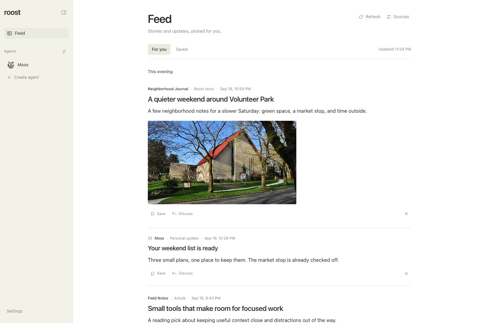

# Shared Feed

Feed brings the publications you follow, stories from a selected Roost agent,
and optional important email updates into one personalized stream. It is shared
between the web and native iPhone app, with stories grouped by when they were
published.

*Real Roost interface with fictional sample data. Select the image for full size.
Photo: [Joe Mabel](https://commons.wikimedia.org/wiki/File:Seattle_-_Volunteer_Park_Seventh_Day_Adventist_Church_02.jpg),
[CC BY-SA 4.0](https://creativecommons.org/licenses/by-sa/4.0/), shown with a landscape crop.*

## Setup

1. Open **Feed → Sources** and enable **Keep my feed up to date**.
2. Describe **Your interests** and **What matters right now**. Include places,
   topics, or projects you want the feed to follow.
3. Add public RSS or Atom feeds and choose how often to check them. Capitol Hill
   Seattle Blog and The Seattle Times local feeds are editable presets.
4. Optionally choose a contributing agent to add sourced context and original
   stories. Enable email updates separately if that agent has a connected email source.

Public sources work without a contributing agent or a Jev key. The feed starts
disabled; saving enabled preferences starts a refresh. Use **Refresh** to check
again between scheduled updates. Roost and its host must be running to refresh.

## Read, save, and shape your feed

Stories appear newest first, grouped into **This morning**, **This afternoon**,
**This evening**, **Yesterday**, and earlier calendar dates in your local time.
Source articles keep their publisher's timestamp when available, attribution,
excerpt, and original link. Agent-written stories include standalone summaries
and citations. A relevant source image appears beneath the summary and in the
reader when one is available.

Choose **Save** to keep a story and **Saved** to find it later. **More like this**
and **Less like this** provide feedback for future curation; **Dismiss** removes
a story from the stream, with an undo action. These changes are shared across
web and iPhone. Opening a story does not create a conversation or mark it read.
Refresh failures appear in the feed so you can distinguish saved content from a
successful new check.

## Discuss a story

Choose **Discuss** to open a reply thread with the story and its sources. This
also sends an initial question asking the agent to explain the story and why it
matters to you. Continue the discussion in that thread, while the Feed remains
your place to read and save stories.

## Jevi / Jev

Roost uses the Jev HTTP API directly; installing the Jevi CLI is unnecessary. Enable Jev relevance scoring and enter a TypeSafe API key in preferences, or provide `ROOST_JEV_API_KEY` (with `TYPESAFE_API_KEY` as a fallback). Environment keys take precedence. Saved keys live in `ROOST_DATA_DIR/secrets/feed-jev-key`, with owner-only permissions, and are never returned to the clients.

The pinned `jev-1.13.0` model separately estimates **interest** (how much you would want to read a story) and **usefulness** (what it could help you learn, decide, plan, or do). Something can be interesting without being useful, or useful without being urgent. Jev also scores importance, actionability, and novelty before an agent spends tokens writing. Requests use bounded public article excerpts, your existing configured interests/priorities, and public-story feedback/history. No separate profile setup is needed.

Open a scored story to see **Usefulness** and **Interest** out of 100 in its **Why** section on web and iPhone. These are labeled as Jev estimates, with a limited-confidence note when confidence is below 0.7. The stream stays in publication order. Scores are cached; stories without a current Jev score show no personal scores. Basic local matching keeps public sources useful without a key or during provider failures. Score confidence is not a factual-verification guarantee.

Private update snippets are excluded from public scoring. **Score private updates with Jev** is a separate opt-in; only then can a published personal update's short summary be sent to Jev. Important private updates remain visible even with a low or failed score. Email retrieval uses the editor agent's existing connected sources and permissions. It is read-only and bounded; Roost does not send, archive, delete, or mark email read as part of feed curation.

## Runtime and validation

The feed is disabled by default. When enabled, the server worker polls on the configured interval and handles manual refreshes through the same database lease. Fetches support RSS/Atom, conditional requests, redirect validation, public-address checks, and response limits. Candidate identity follows canonical URLs. Refreshes preserve saved/read state, publish only under current preferences, and queue the selected editor through Roost's durable run system. Email checks revisit a rolling 24-hour window with stable event keys, so an unavailable inbox or a previous pass with email disabled cannot advance a cursor past unseen messages. The initial version inspects at most 25 recent messages per pass and does not backfill older mail.

Data lives in additive `feed_*` tables in the existing agent database. Agent deletion removes publication/discussion receipts and detaches the editor while preserving shared feed history. Settings use revision checks so simultaneous web and mobile edits cannot silently overwrite one another.

Tests cover source parsing and network boundaries, mocked Jev protocol and consent, real SQLite persistence and migration, refresh leases and fallbacks, publication ownership and retries, and the authenticated mobile API. Browser and simulator flows cover the visible reading, preferences, saving, dismissal, and discussion paths. Live Jev scoring and a real connected-email run require configuring those services locally; the test fixtures use no real inbox or provider key.
