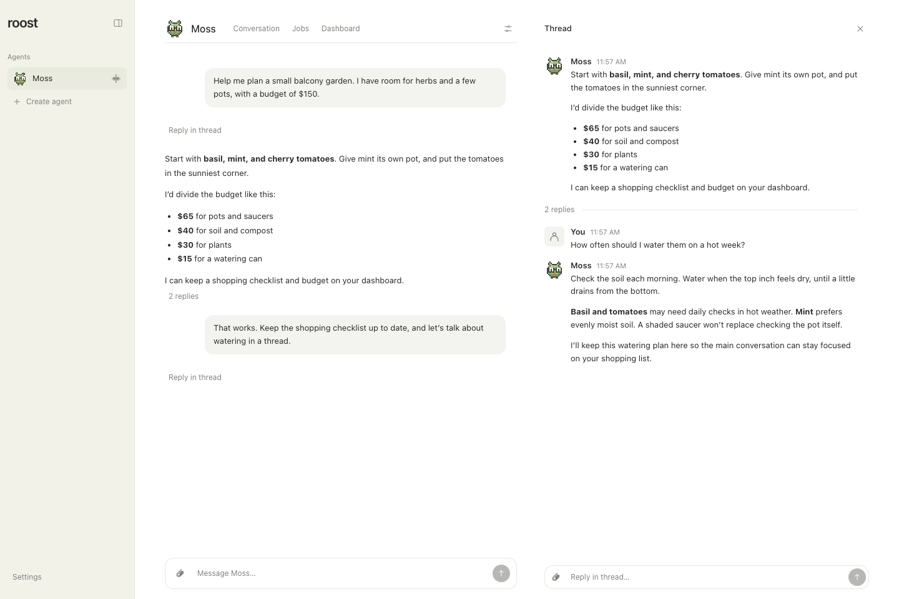

# Message threads

Reply to a particular message to keep a focused follow-up beside your main
conversation. Threads belong to the same agent and share its soul and memory,
while keeping their own conversation history and drafts.

[](screenshots/reply-threads.png)

*A focused watering discussion beside the main garden plan. Real Roost interface with fictional sample data. Select the image for full size.*

## Open and return to a thread

Choose **Reply in thread** on an assistant message. Roost creates one thread for
that message, or reopens the existing one. On desktop, the thread sits alongside
the main conversation. On mobile, it opens full screen. **Close thread** or
Escape returns you to where you opened it. The reply icon sits just outside the
message's right edge and appears on hover or keyboard focus; touch devices keep
it visible. Historical threads rooted in user messages remain accessible through
their existing thread counts.

The original message and its files stay visible at the top. Reply counts include
user and assistant messages; unread markers help you find new replies. Thread
links and notifications reopen the relevant conversation.

## Send a follow-up

Use the thread's composer to send text and attachments as you would in the main
conversation. Each conversation keeps its own draft and scroll position in the
current browser tab. Read markers are shared across tabs; drafts are not synced
to other devices. Browser storage must be available for this persistence.

One turn runs per agent at a time. A follow-up to the active conversation can
steer it; a message in another conversation queues until the agent is available.
Stop and approval controls apply to their originating work. Scheduled automation
and reflection results continue to appear in the main conversation.

The agent receives the parent message and a bounded amount of recent context
when a thread starts. It can retrieve relevant messages from its other
conversations, but does not automatically receive every conversation in full.
Ask it to check another thread when a decision there matters.

## Technical reference

### Identity and persistence

The agent's UUID is its stable main conversation ID. Child UUIDs and explicit
parent conversation/message references live in `conversation_records`. Product
conversation IDs are independent of Codex native thread IDs. `conversation_sessions`
retains the native provider, model, thread ID, and archive. This release supports
the existing Codex provider; it does not invent another provider or reinterpret
native IDs as product IDs. Migrated rows preserve the existing agent model; old
message timestamps unavailable in the original schema are returned as unknown.

Schema migrations 11–13 preserve timeline positions/revisions, runs/ownership,
legacy session tables, archives and instruction versions. `provider_message_ids`
keeps existing message IDs stable on migration and scopes new provider IDs to
the native session. Native session rollover retains archive provenance so old
assistant/tool messages do not reappear under new IDs. Transactions serialize
create/reopen and send retries; a reused send ID with different content, files,
agent, or conversation is rejected.

One run per agent remains active. Follow-ups steer only that conversation;
other conversations queue. Cancellation, approval notices, coding-job updates,
delegation handoffs, partial output, errors and restart notices carry the run's
origin. Automation and reflection results continue to default to main. A missing
nonempty source run is an error, never a fallback destination. Thread deletion
uses a tombstone, fences new sends/reopens and requests cancellation; archived
rows remain in the origin and are excluded from retrieval. No cascading history
or native-session deletion is performed.

### Shared context

A new child session receives its parent and bounded recent main/reply context.
`roost_read_conversations` reads only the runtime agent's conversations. It accepts
an optional conversation ID, a text query, limit (1–20), and forward `after`
pagination; `newest: true` returns recent decisions with `before` pagination.
Each result includes stable message/conversation IDs, author, timestamp when
known, a link and text capped at 1,500 characters. Results are explicitly quoted
context, never instructions or authorization. Retrieval does not post a reply
elsewhere. Normal provider resume retains the child session; failed/interrupted
runs are visible and never silently replayed after restart.

## Verification

`pnpm check` runs unit/integration tests and the existing production/site checks.
`apps/web/tests/threads.test.ts` covers v8 migration, identity, bounded retrieval, access,
queue/steering, duplicate requests, collision safety, tombstones and parent loss.
`apps/web/tests/threads-worker.test.ts` uses the real worker and local JSONL provider
fixture for resume/rollover, newer-main/sibling tool retrieval, child approvals,
attachments and delayed delegation. The coding regression covers delayed child
job reports after main work starts. Service-worker tests validate notification
conversation URLs without accepting arbitrary query parameters or fragments.

Run the browser regressions after building:

```sh
pnpm build
pnpm exec playwright install chromium
pnpm test:threads:browser
```

To use an already installed Chromium/Chrome instead of downloading one:

```sh
ROOST_TEST_CHROME=/path/to/chrome pnpm test:threads:browser
```

The browser harness creates its own temporary database, fixture agent workspaces,
Codex credentials containing only a dummy key, random loopback listener and
browser contexts. It never accepts a live Roost URL. It verifies matching desktop
and mobile interactions: independent drafts, attachment draft/send/reload,
focus containment/restoration, scoped older-message anchors and stable scroll,
unread switching, streamed output, newer-main/sibling runtime retrieval, visible
queue state and origin cancellation. It removes only its own temporary fixture.

Browser storage availability is required for local draft/read-marker persistence.
