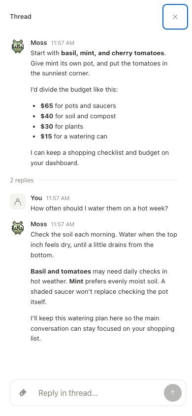

# iPhone and mobile web

Use Roost from the native iPhone app or your phone's browser. Both connect to the
same server, agents, Feed, notes, and trackers. Agents keep working when you close
either client, while Roost and its host remain running.

## Native iPhone app

The SwiftUI app lives in `apps/ios` and requires iOS 17 or later. Build it with
Xcode 16 or later; physical-device installation needs Apple signing. Follow the
[native setup guide](https://github.com/srctl/roost/blob/main/apps/ios/README.md)
for the project, signing, and device-token setup. TestFlight/App Store distribution
and native push notifications require separate Apple configuration.

On the server, create a token for this device:

```sh
roost mobile create --name iPhone --output ~/iphone-token.txt
```

Enter the server's HTTPS origin and that token in the app. The token is written
once to an owner-readable file; transfer it privately and remove the transfer
file after connecting. The app stores the connection in the iOS Keychain.
It needs a directly reachable mobile API: an interactive browser-login proxy
does not pass its cookies to the native app. The setup guide explains this boundary.

### Move between your agent's work

Use the bottom bar for **Chat**, **Dashboard**, **Notes**, and **Coding** for a
coding agent. Each section keeps its own navigation history. **More → Computer**
opens the shared desktop. The bar makes room for the keyboard while composing.

- Swipe right on an assistant message to open a focused reply thread, or use its
  context menu. Main conversations and reply threads keep separate drafts.
- Attach photos or files, inspect image previews, and open attachments with
  Quick Look. You can send an attachment without adding text.
- Edit [trackers](dashboards.md), check weather, and inspect native charts in
  Dashboard or directly in chat. The selected dashboard view is shared with web.
- Open **Feed** beside Agents to read and save the same [personalized stories](feed.md).
- Open **Settings → Payments** or the conversation's Payments control to review
  [Link purchases](payments.md) and continue approval in Link.

### Keep a draft through connection recovery

Unsent drafts and pending sends recover after the app closes. Retrying an
uncertain send uses its original message ID and payload, preventing duplicate
turns. A confirmed rejected send returns to an editable draft.

Use **Settings → Replace device token** to renew an expired token and keep drafts
for the same server. **Disconnect this iPhone** revokes the token and clears local
drafts. Reopening the app refreshes saved server state; conversation history and
actions still require a connection.

## Home-screen web app

Open your Roost HTTPS address in Safari, then choose **Share → Add to Home Screen**
and open it as a web app. Roost provides a standalone manifest, app icons, and an
Apple touch icon. The page and browser chrome follow your saved
[theme and appearance](settings.md); System follows the device's light/dark
appearance. The installed iOS status bar overlays a safe-area-padded header.

Mobile headers use an opaque background and `position: sticky; top: 0` while
remaining in the layout. This gives WebKit a small, independently detected top
bar whose color can extend into the status-bar area, instead of depending on the
full-height app shell for scroll-edge rendering. It targets the iOS 27 blur that
can cover the menu and title. Safe-area padding, viewport height, and keyboard
handling remain unchanged. See WebKit's [fixed-edge detection change](https://github.com/WebKit/WebKit/commit/8b209a7da992cc5728c936b41afc2ae5dbafd2e5).
Desktop browser checks can verify geometry and navigation, but this OS-rendered
effect still needs confirmation in an installed app on the affected iOS version.

Startup at `/` reopens the last agent visited in this browser or home-screen app.
The choice is stored locally on the device. If the agent is missing, storage is
unavailable, or no agent has been visited yet, startup shows the agent list.
Direct links keep their destination. Tap **roost** in navigation to open the list
without being redirected; an empty workspace offers **Create an agent**.

Swipe right across the page to open the agent picker, or tap the menu button.
Use a short, mostly horizontal swipe outside text inputs, controls, and horizontally
scrolling content such as code blocks and tables. Swipe left across the drawer
to dismiss it, including across an agent row. You can also select an agent, tap
outside the drawer, or use its close button.

On phones, the document stays fixed while the conversation or settings content
scrolls inside it. While the keyboard is closed, browser tabs use the dynamic
viewport (`100dvh`), while installed standalone apps use the full viewport
(`100vh`) for both the document and app shell. iOS can underreport dynamic and
percentage heights in standalone mode, leaving a bottom gap. Safe-area padding
is applied inside that full height, once at the header and composer.
While an input is focused and the keyboard reduces the available height, the app
follows the visual viewport's height and top offset. On blur it removes those
overrides, including when iOS retains a stale visual viewport size. The composer uses 16px text to avoid input zoom and
removes the home-indicator inset while the keyboard occupies that space.

The composer's Send and Stop circles are 36px on mobile (including home-screen
apps), inside 44px touch targets. Desktop circles remain 28px. During a running
turn, a draft containing non-whitespace text shows only Send. Clearing the draft
restores Stop, as does a successful send if the turn is still running. Whitespace
alone counts as empty, matching message sendability. Attachment-only drafts retain
both Send and Stop; adding text hides Stop without changing attachment submission.
Uploads, loading, and pending sends still disable Send. Failed sends retain the
draft, and text edited while a send is pending is preserved. Idle turns keep their
existing Send control, disabled until there is text or an attachment to send.

[](screenshots/reply-thread-mobile.png)

*A reply thread opens full screen on mobile; closing it returns to the main conversation. Real Roost interface with fictional sample data. Select the image for full size.*

Production builds register a service worker that caches immutable build assets,
supports push notifications, and supplies an offline screen when a navigation
cannot reach the server. It does not cache conversations, credentials, attachments,
HTML pages, or API responses. See [startup measurements](pwa-startup.md) and
[notification setup](notifications.md). Updates arrive on the next
page load; an active conversation is never automatically reloaded. Roost still
requires a connection to its server to send messages or control the computer.

Home-screen icon links use versioned PNGs from Roost's public GitHub repository.
iOS may fetch these without the browser's authentication cookie, so serving them
behind an authenticated private proxy can produce a blank icon. Only public branding
assets use this URL; the app, conversations, and desktop remain authenticated.
The SVG favicon and local PNG copies are also included in every release.

After an update, reload the page. If iOS retains an old home-screen icon or launch
appearance, remove the shortcut and add it again. Desktop WebKit emulation covers
layout checks, but keyboard animation and installed status-bar behavior also need
checking on a physical iPhone.

The standalone height workaround follows [WebKit bug 254868](https://bugs.webkit.org/show_bug.cgi?id=254868#c2).
If installed before the status-bar metadata was added, iOS may require removing
and re-adding the home-screen app; [WebKit bug 316008](https://bugs.webkit.org/show_bug.cgi?id=316008)
describes metadata captured at install time that does not update afterward.
