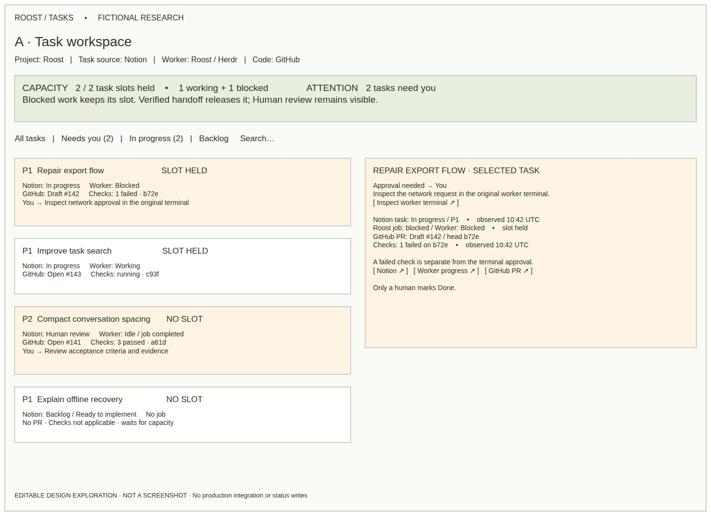
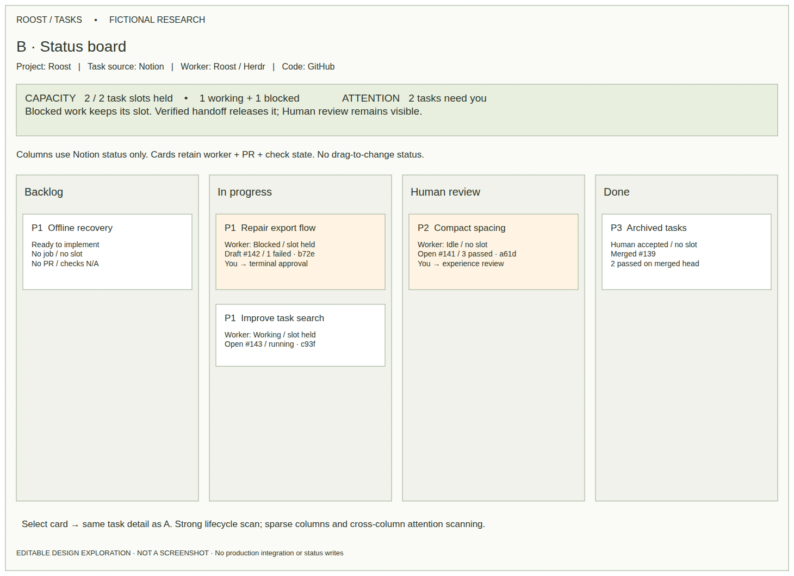
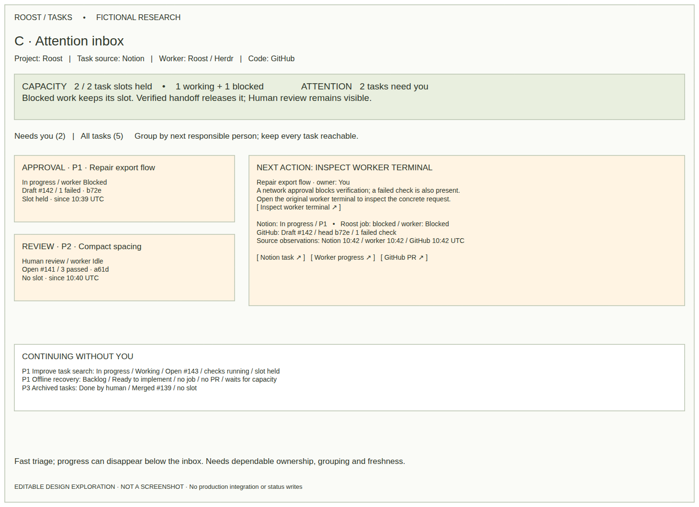
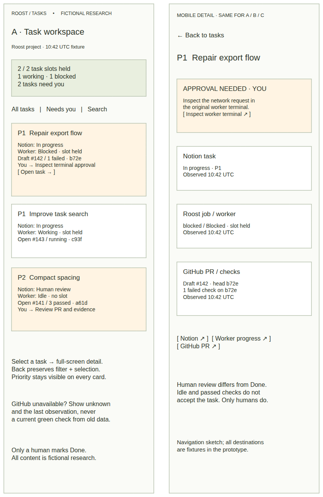
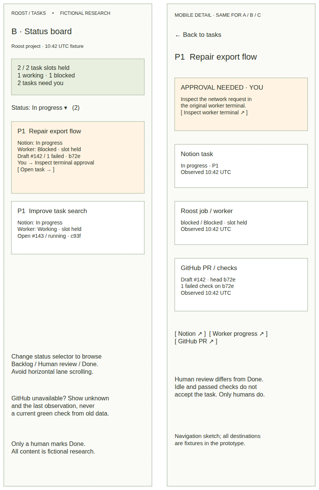
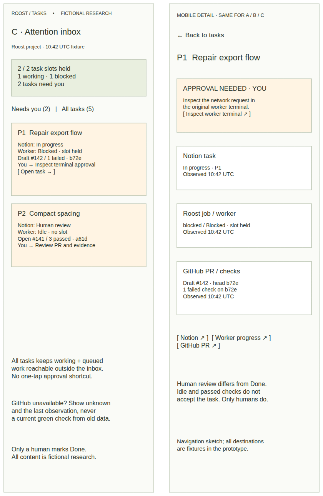
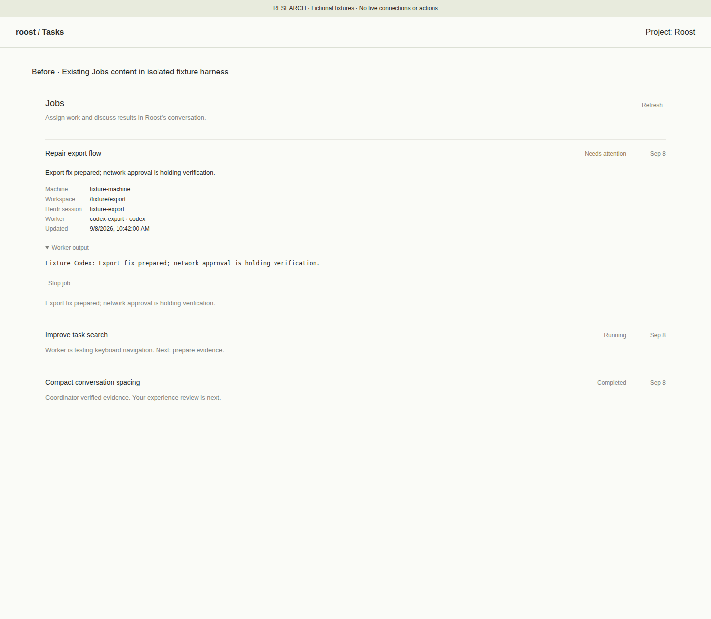
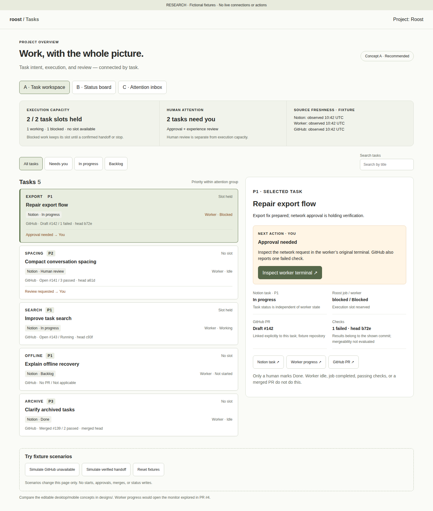
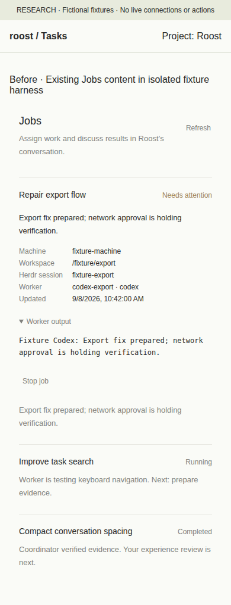
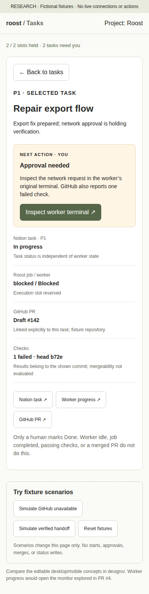

# Unified task view — research for a product decision

Recommend **A: a task workspace with a selected-task detail panel**, an explicit two-task capacity summary, and a “Needs you” filter. On mobile, open task details as a separate view with Back preserving the list filter. Keep B (status board) as an optional planning view and borrow C’s attention grouping rather than making an inbox the only home for work.

This is a separate research/prototype from [coding-worker monitoring PR #4](https://github.com/srctl/roost/pull/4). It adds a task-level navigation layer above that monitor; it does not repeat the terminal/output prototype. Everything here is fictional, local presentation data. No production route, backend, synchronization service, worker control, Notion write, GitHub action, host configuration or dependency manifest changed.

## Compare the options

Each `.excalidraw` contains native editable rectangles and text, not embedded screenshots. Download and open it directly in Excalidraw. No custom editor or generation tooling is required. SVGs and PNGs are actual exports of those files. Mobile files show list and detail screens side by side; each screen is 390 px wide. These design exports are **wireframes, not before/after screenshot evidence**.

| Option | Desktop: editable / viewable | Mobile: editable / viewable |
| --- | --- | --- |
| **A · Task workspace — recommended** | [Excalidraw](designs/a-desktop.excalidraw) · [SVG](designs/a-desktop.svg) · [PNG](designs/a-desktop.png) | [Excalidraw](designs/a-mobile.excalidraw) · [SVG](designs/a-mobile.svg) · [PNG](designs/a-mobile.png) |
| B · Status board | [Excalidraw](designs/b-desktop.excalidraw) · [SVG](designs/b-desktop.svg) · [PNG](designs/b-desktop.png) | [Excalidraw](designs/b-mobile.excalidraw) · [SVG](designs/b-mobile.svg) · [PNG](designs/b-mobile.png) |
| C · Attention inbox | [Excalidraw](designs/c-desktop.excalidraw) · [SVG](designs/c-desktop.svg) · [PNG](designs/c-desktop.png) | [Excalidraw](designs/c-mobile.excalidraw) · [SVG](designs/c-mobile.svg) · [PNG](designs/c-mobile.png) |

| A · Task workspace | B · Status board | C · Attention inbox |
| --- | --- | --- |
|  |  |  |
|  |  |  |

| Decision dimension | A · Task workspace | B · Status board | C · Attention inbox |
| --- | --- | --- | --- |
| What is progressing? | All tasks plus selected detail; worker state and summary directly visible | Notion lifecycle scan is strong; execution is a second dimension on cards | Ongoing work is secondary to attention items |
| Can another task start? | Persistent capacity summary; slot label per task | Same summary needed; column count is not capacity | Same summary needed; inbox count is not capacity |
| What needs me? | “Needs you” filter and explicit owner/next action | Approval and review are in different columns | Fastest triage; one item per task, multiple reasons in detail |
| Navigation | Proposed Tasks entry under the project/coding agent; worker link opens PR #4 monitor | Optional view toggle inside Tasks; select card for detail | Optional attention view/filter; always retain All tasks |
| Mobile | List → detail → Back; avoids a narrow split pane | Status selector in sketch avoids horizontal lanes | Needs you → task → original action surface |
| Main cost | Dense cards; decide which metadata deserves the first line | Sparse columns, cross-column attention scanning; dragging invites unintended task writes | Depends on trustworthy ownership and deduplication; quiet work can be overlooked |

A uses attention-first grouping, then priority within a group. This intentionally lets a P2 human review appear above a P1 task that is already running. It does **not** change Notion priority or define pickup order. The sketch and prototype vary card density and ordering to expose this decision, rather than claim pixel-final design.

## Current workflow and evidence

Reviewed source at [`3f7bae2`](https://github.com/srctl/roost/tree/3f7bae2), the complete PR #4 body, and its allowed local research artifacts on 2026-09-08. No private session/memory files or live Roost storage were read. The current assignment supplies the two-task limit, readiness/priority rules, and human-only Done boundary; these are project workflow assumptions, not discovered global product guarantees.

- [Coding workflow](../../coding-agents.md): the coordinator reads an assignment, prepares an isolated workspace, starts a Herdr worker, reviews results and reports back. Notion tooling is separate; configuring a source does not enable automatic pickup or synchronization.
- [Existing Jobs route](../../../src/routes/agents.$agentId_.jobs.tsx): job rows expose assignment, summary, machine, session, output and optional source link. Task priority, Notion property snapshots, explicit human ownership, PR state and checks are not structured here. Before screenshots render this actual content with inert boundaries.
- [Job schema](../../../src/features/coding/schema.ts): `CodingJobStatus` is `queued|starting|running|blocked|review|completed|failed|cancelled`. `sourceUrl` can link to a task, but it is not a structured task relation or a Notion status/priority snapshot. A job’s `completed` label must not become a task’s Done label.
- [Worker polling](../../../src/server/coding/worker.server.ts) and [Herdr adapter](../../../src/server/coding/herdr.server.ts): worker states and job states differ. Observed idle/done after work can move a job into coordinator review. Output is a bounded replaceable text snapshot with ownership checks, not a semantic progress stream or completion proof. PR #4 already investigates that monitoring layer; its recommended monitor is the destination of “Worker progress,” not reimplemented here.
- [GitHub status-check documentation](https://docs.github.com/en/pull-requests/reference/status-checks): checks and commit statuses report validation against commits. A completed check has a conclusion; skipped/neutral differ from an actual passing test. Therefore a future UI needs commit identity and underlying conclusions, not just a green badge. This prototype says “mergeability not evaluated.”

## Keep the relationships explicit

| Dimension | Authority / useful information | What it does not imply |
| --- | --- | --- |
| Task status + priority + readiness | Current Notion properties; stable task ID/URL; P1/P2/P3; readiness independent of status; observation time | Backlog may be Ready to implement. Old prose such as “Still thinking” does not override current properties. Priority does not indicate execution or permission. |
| Roost job | Job ID, owning coordinator, assignment/attempt, summary, lifecycle, workspace, last observation | `review` means coordinator verification is needed, not that the human has received a verified result. `completed` does not mean task Done. |
| Worker | Working/blocked/idle/done/unknown/missing, session identity, observed time, useful next step | Idle/done can mean only that a turn ended. Missing/unknown does not mean stopped or available capacity. |
| Human attention | Reason, responsible person, concrete next action, source destination, first/last observation | Not every failure needs a human. A worker may already be fixing CI; no generic Approve control should bypass its original terminal. |
| PR | Repository + PR number/URL, draft/open/closed/merged, head SHA, requested review | A draft can have passing checks. A closed PR may be unmerged. A merged PR does not accept the task. |
| Checks | Check/run name, status and conclusion, commit SHA, requiredness if known, observed time | “Passed” on an earlier SHA is not current validation; absent checks are not successful checks. Passing checks do not imply review approval or mergeability. |
| Human review / Done | Coordinator hands verified result to human; human checks acceptance and decides Done | Human review is a pending decision. **Only humans mark Done**, even if the PR merged or the job completed. |

A future read model would join **task → zero or more job attempts → explicitly linked zero or more PRs**, with check results keyed by repository and SHA. Use stable IDs/explicit links, never title matching or parsing terminal text as authoritative status. Show prior attempts under the task and multiple PRs separately; a missing or ambiguous relation needs “Unlinked / needs verification.” Ad hoc jobs need “No task source,” not an invented Notion status. These are proposed relationships, not a synchronization design or implemented adapter.

## Capacity and attention policy to validate

The fixture has five tasks: one blocked P1 and one running P1 holding the two slots, one verified P2 awaiting human review with no slot, one ready P1 in Backlog with no job, and one human-completed P3. The before view has the same three relevant jobs and selected blocked assignment; the two tasks without current jobs only appear in the new task view.

Count **reserved assignments**, not terminal panes, open PRs, Notion In progress rows, or busy-worker count. Reserve through preparation, running and blocked states. Keep an uncertain launch or lost worker observation reserved until inspected. A queued candidate without a reservation does not consume a slot. Only an explicit coordinator-confirmed handoff or confirmed stop releases one; terminal idle alone does not. A human review can coexist with two other active assignments, so show attention separately from execution capacity.

The “verified handoff” scenario atomically changes several fixture fields for demonstration: job completed, worker Idle, task Human review, checks passed and one reservation released. In real sources these observations can arrive independently, fail, or disagree; never derive one from another. If Notion fails to update, show verified job and stale task status side by side. Do not auto-start the next Backlog task merely because a slot opened.

Group multiple attention reasons for the same task into one inbox item: the blocked export has a terminal approval **and** a failed check, but counts as one task needing attention. Identify the current owner. Route approvals to the original worker terminal, reviews to PR/evidence and acceptance criteria, clarification to the coordinator conversation, and infrastructure failures to whoever can resolve the named dependency. Show blocked duration and observation provenance in a future detail view. Avoid repeating a failure notification while a worker is already handling it.

Freshness is per source, not a global green dot. A GitHub outage preserves the old result as “last observed,” shows current checks unknown, and does not change task/worker/capacity. A missing worker feed must similarly show uncertainty and preserve the reservation; that scenario is documented but not implemented. If capacity itself cannot be established, show “unknown / last known 2 of 2” and require inspection rather than suggesting an available slot. Observation-age thresholds and retry policy need a later integration decision.

## Bounded prototype and review exercise

Run the local prototype below. Desktop starts with the blocked task selected. Mobile starts in its detail view to match the before capture; use **Back to tasks** for the list and layout toggles. All source controls display a labeled fixture destination; they do not navigate to real tickets, PRs or terminals.

Try these decisions in A, B and C:

1. Identify why the third P1 cannot start. Which task holds the blocked slot and who can unblock it?
2. Filter Needs you, select Compact conversation spacing, and explain why it remains Human review despite passed checks and a completed job.
3. Simulate GitHub unavailable: distinguish current unknown from the old check snapshot without losing the task or slot count.
4. Simulate verified handoff: observe one free slot, the new human review, and no automatic start or Done transition.
5. Search for a missing task; then “offline” to inspect a ready Backlog task without a PR. On mobile, return to the filtered list without losing context.

The prototype uses one current job and PR per task, title search, in-memory selection/filtering, and fixed UTC observations. Reload resets it. Alternative layouts reuse A’s detail component; B’s mobile prototype stacks status groups, while its sketch proposes a status selector to compare in a later usability pass. There is no browser-history/deep-link persistence, actual worker monitor, polling, real connection, permission resolution, task mutation, or production styling abstraction. A has the most complete interaction treatment.

## Assumptions and open product decisions

- **Entry point:** propose Tasks under the project/coding agent and retain Jobs as execution detail. Decide whether a global cross-project view is needed; this research stays with one project.
- **Default order:** choose between attention-first (prototype), execution-first (A sketch’s initial list), and strict priority-first. Pickup still uses current eligibility/priority rules; view sorting must not silently schedule work.
- **Capacity scope:** assume two execution assignments for this project, excluding verified Human review. Confirm whether the real limit applies across all projects or includes human review WIP; show any review limit separately.
- **Handoff:** decide the exact coordinator evidence/acknowledgment needed to release a slot and how stop/uncertain launch reservations are reconciled. No reservation service is implemented.
- **Authority conflicts:** settle property mapping for each Notion source, freshness thresholds and whether a task marked Done with an active worker shows a reconciliation warning. No inferred rewrite of source status.
- **Attention:** agree how to distinguish user-owned blockers from worker/coordinator-owned follow-up, whether review age affects ordering, and whether acknowledgments/snoozing are desirable. An acknowledgment must not clear the source blocker.
- **Scope after review:** if A is chosen, separately authorize a read-only task/job/PR linkage spike with fixture contract and failure cases. Decide source access and identity mapping before estimating any synchronization service. User testing, screen-reader audit, dark mode, many-task performance and live-source behavior remain unverified.

## Actual rendered before / after

Baseline was captured **before implementing the unified UI**. Both pairs use light mode, UTC, device scale 1, desktop **1440×1100** and mobile **390×844** viewports. Full-page capture heights vary. Selected task is Repair export flow, blocked with unchanged fixture summary/output. The before job and Worker output disclosures are open; the after shows its task detail.

**Baseline limitation:** the existing Jobs content/StyleX was extracted from the base route into a temporary capture harness. Router, refresh, stop and server boundaries were inert, and the agent header/app shell were replaced by the same small presentation harness. That capture-only harness is not part of the delivered prototype. These are actual browser-rendered component captures, **not an authenticated live Roost screenshot**. Baseline cannot show task/check fields the current route does not have. No unlabelled mockup substitutes for screenshot evidence.

| View | Before · actual existing Jobs content, fixture harness | After · actual unified prototype, same assignment |
| --- | --- | --- |
| Desktop |  |  |
| Mobile |  |  |

Additional rendered evidence: [mobile list](screenshots/list-mobile.png), [desktop review](screenshots/review-desktop.png), [mobile review](screenshots/review-mobile.png), [desktop stale GitHub](screenshots/stale-desktop.png), [mobile stale GitHub](screenshots/stale-mobile.png), [desktop handoff](screenshots/handoff-desktop.png), [mobile handoff](screenshots/handoff-mobile.png), [B desktop](screenshots/option-b-desktop.png), [B mobile](screenshots/option-b-mobile.png), [C desktop](screenshots/option-c-desktop.png), [C mobile](screenshots/option-c-mobile.png). [Editor screenshots](screenshots/editor-a-desktop.png) demonstrate native Excalidraw loading; all six are in `screenshots/editor-*.png`.

## Run the prototype

From the repository root with its locked dependencies installed:

```sh
node node_modules/vite/bin/vite.js --config docs/prototypes/unified-task-view/vite.config.mjs
# http://127.0.0.1:4182/ — unified fixture prototype
```

The prototype binds loopback and uses only its fictional fixtures. Its required UI, fixtures and Vite config are committed. Open the six `.excalidraw` deliverables in Excalidraw; SVG/PNG exports can be viewed directly. The before screenshots document the temporary baseline harness, which is no longer a runnable route.

One-off capture/generation/validation scripts, the custom validation editor, raw logs and capture metadata are excluded from the PR. Copies remain in this worktree's ignored `.roost/unified-task-view-cleanup/` for coordinator reference; they are not a dependency or a promised reproducible toolchain for reviewers.

See [concise verification results and limitations](evidence/VERIFICATION.md). All production integration is deferred pending the experience decision.
