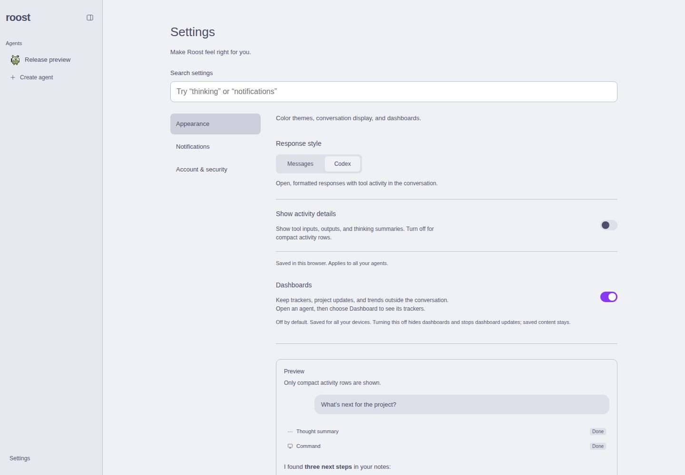
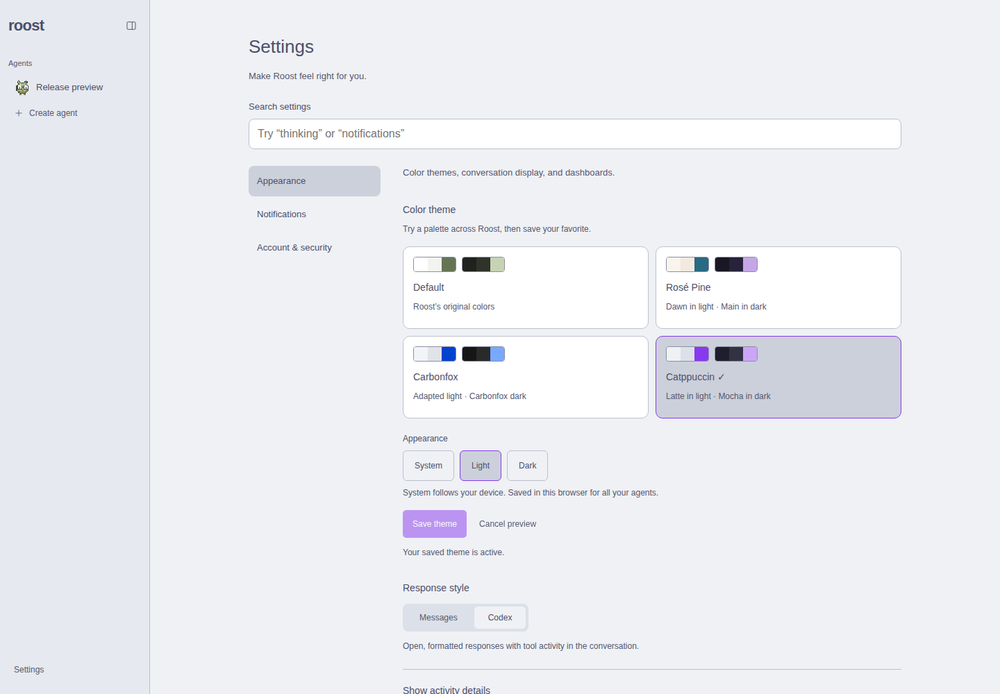
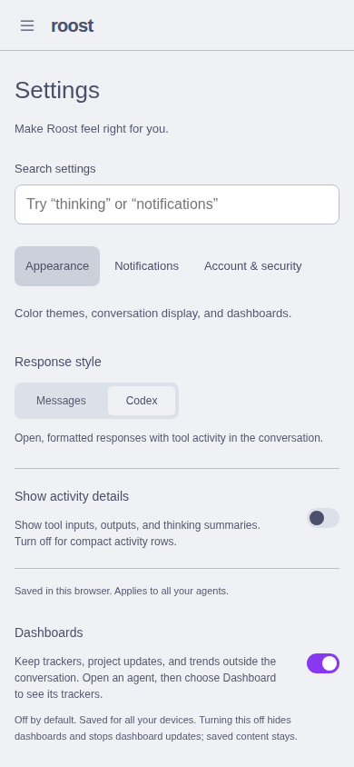
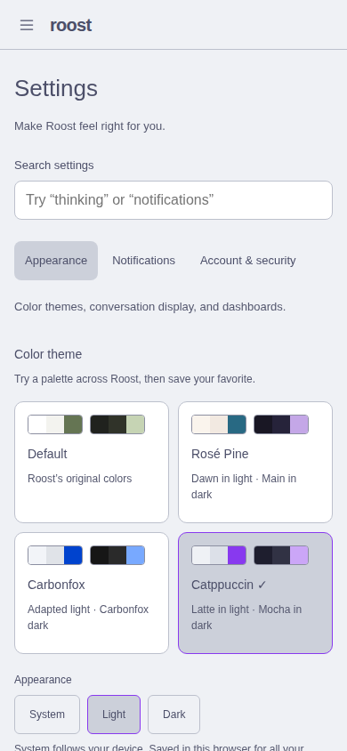
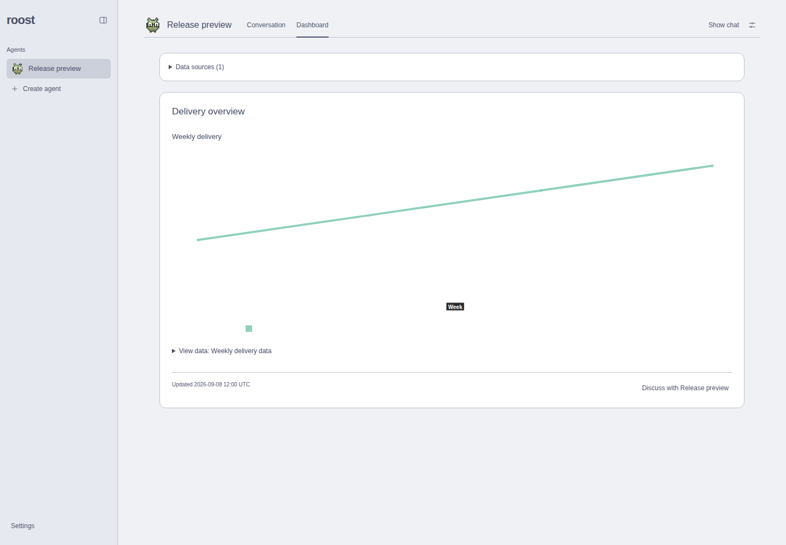
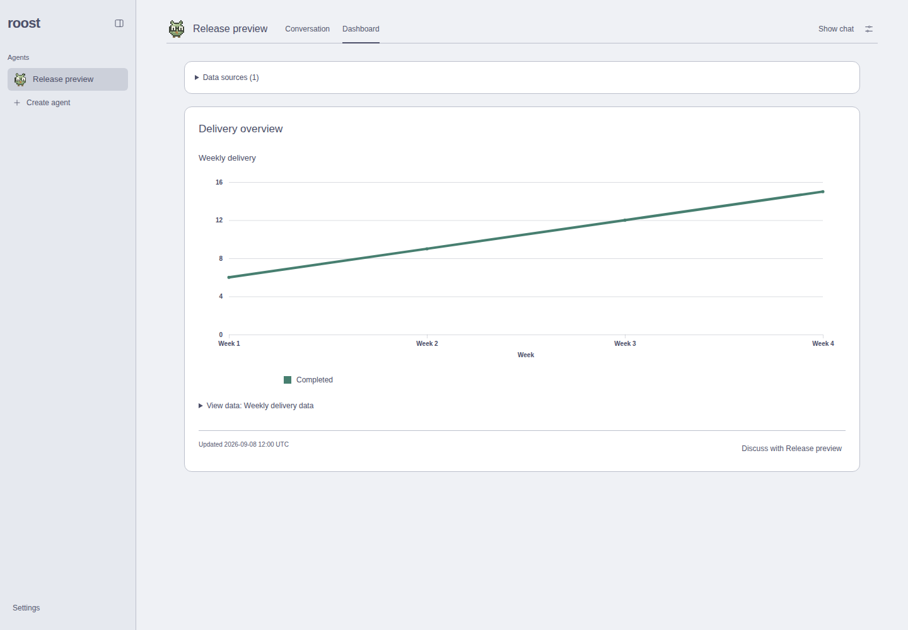
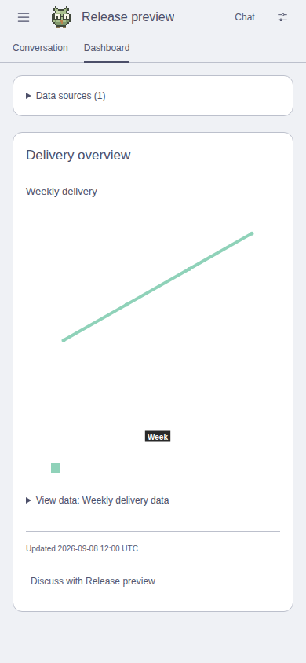
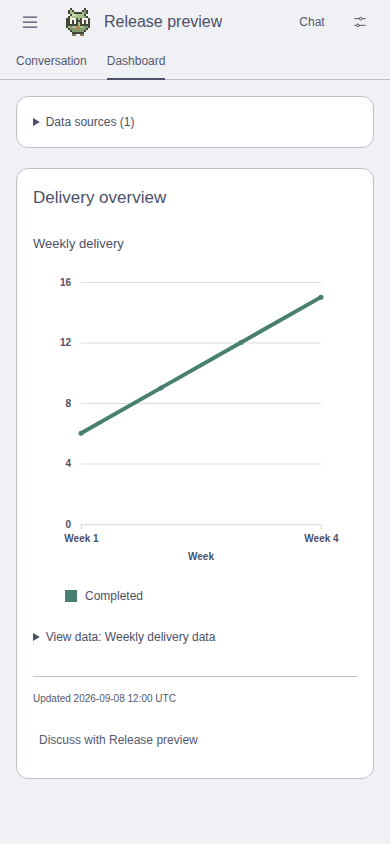

# 0.1.39 integration verification

Only PRs #2, #3, #5, #6, #7, and #9 are included. Application source verified at
`dc345d72f0587fcd2a96bd3db534c32f6672157e`; subsequent changes are documentation
and screenshots only. This record does not publish or deploy a release.

## Integration fixes

- Database schema 10 upgrades version 8 and either feature-preview schema 9.
  It creates missing dataset storage and adds the nullable automation model only
  when absent, in one transaction. Existing rows and settings are preserved.
- Tool version 12 upgrades both version-10 and version-11 threads to the combined
  tool inventory while preserving visible history and private agent paths.
- Appearance retains the accessible theme picker, preview/save/cancel, and all
  existing display controls. Search indexes palette names, variants, and actions.
- Fluent charts use the active Roost palette and Light/Dark/System preference,
  including theme previews. Explicit appearance overrides device media.
- Removed disposable theme/chart/composer scripts, the fixture-only composer
  harness, dedicated package commands, and the unused Playwright dev dependency.
  Production dependencies, regression tests, and review screenshots remain.

## Checks

Using Node 24.15.0, pnpm 9.15.0, test-process umask 022, sanitized inherited
Codex/Nitro/Roost overrides, loopback servers, and disposable data only:

- Full `pnpm check`: PASS; 153 regression tests, lint/typecheck, app/CLI production
  builds, production-auth enrollment/login/access/revocation/recovery, six site
  tests, and site typecheck/builds.
- Migration tests compare all existing table rows across upgrades from base v8,
  dataset-only v9, and model-only v9, then repeat each open. Existing model choices,
  dataset revisions, agent instructions/history, dashboards, and settings survive.
  Fixture execution tests verify combined tools on upgraded v10/v11 threads.
- Theme browser suite: 16 desktop/mobile palette views and 8 sample conversation
  views; preview/cancel/save/reload/navigation, keyboard, System changes, blocked
  cookies, and server first paint with JavaScript disabled all pass.
- Settings navigation/search: 1440×1000, 390×844, 320×740; group URLs/back/forward,
  theme vocabulary, dependent controls, empty results/Clear/Escape, and preference
  persistence pass with no overflow or uncaught browser errors.
- Charts: all six styles, legacy charts, missing/empty sources, keyboard tables,
  source catalog, legends, resize, and polling updated revisions/values pass on
  desktop/mobile. Each viewport reports one previously documented React 418
  hydration warning; no other errors. No warning is suppressed in production.
- Combined theme/chart/scroll matrix: all four palettes × three appearance modes
  × desktop/mobile; chart colors checked under both light and dark device media
  (48 states). Button threshold, keyboard/touch, focus transfer, 44px target, and
  composer clearance pass. Separate desktop/mobile checks pass for streamed
  edits, manual scroll preservation, pagination, agent switching, and growth.
- Real production composer with fixture worker: busy/text/whitespace transitions,
  send/stop dimensions, stopping, and bottom-jump draft retention pass. The ignored
  component harness also passes desktop/mobile/standalone-emulation attachment,
  failed-send, pending-draft, keyboard/touch, and upload cases.
- Production automation form: desktop/mobile catalog selection, saved Luna after
  reload, reset to agent default, and unavailable-selection recovery pass. Backend
  tests cover scheduled/manual execution, revision checks, snapshots, and isolation.

Disposable scripts and logs are ignored under `.roost/release-0.1.39/` in the
prepared release worktree; none are part of the release tree.

## Matched actual rendered screenshots

These are production-browser captures, not mockups. **BEFORE** shows the original
feature components before integration fixes: the Settings route from PR #9
`261338e` and Fluent chart from PR #5 `9cd53a4`, built in an isolated copy of the
candidate. **AFTER** is the resolved candidate `dc345d7`. BEFORE is not v0.1.38;
the original feature PRs retain their separate baseline comparisons.

Each pair uses the same route, top scroll position, viewport, device scale 1,
reduced motion, unfocused controls, and saved Catppuccin/Light with a dark device
preference. Settings uses Appearance, no search, Codex response style, activity
details off, dashboards on. Charts show the same fictional weekly dataset,
revision 1, fixed timestamp, closed data disclosure, and closed chat panel.
The before chart's device-driven white labels disappear against the saved light
surface; the after labels and series follow the selected appearance.

| Screen | BEFORE | AFTER |
| --- | --- | --- |
| Settings · desktop 1440×1000 |  |  |
| Settings · mobile 390×844 |  |  |
| Charts · desktop 1440×1000 |  |  |
| Charts · mobile 390×844 |  |  |

[Capture provenance, measured provider colors, errors, and image hashes](capture.json).
All eight captures report no uncaught browser errors or horizontal overflow.

## Limits

Chromium desktop/mobile emulation, not physical phones, Safari/Firefox, or an
installed PWA. Model calls use fixture Codex processes; no live inference or
external delivery was exercised. Vite retains the extensionless-config-import
warning and the Fluent lazy-chunk size advisory. No live host, settings, or
storage was changed.
