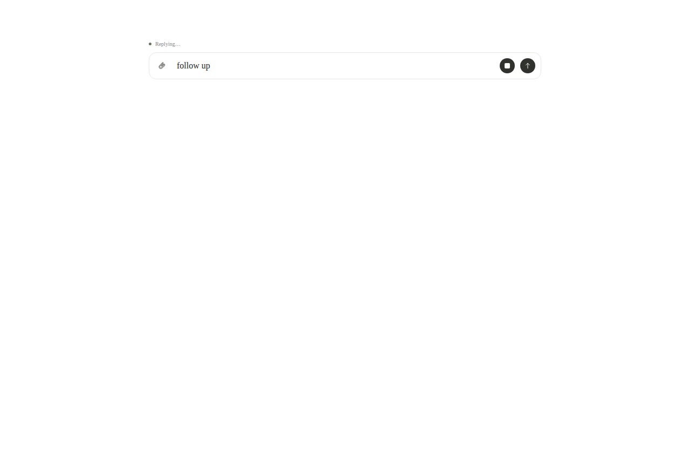
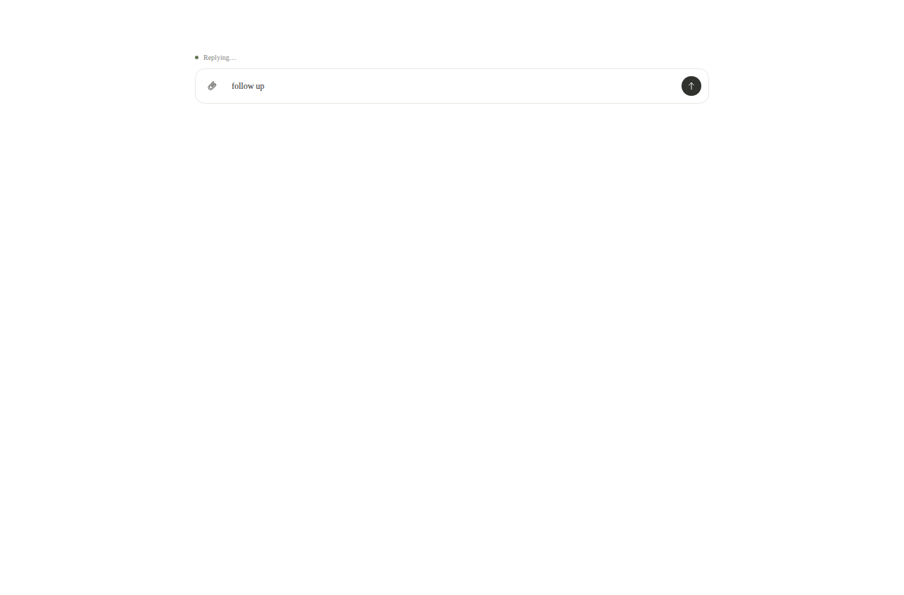
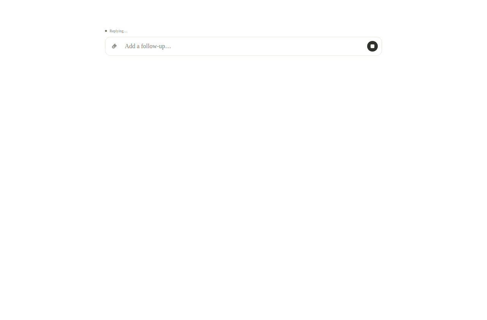
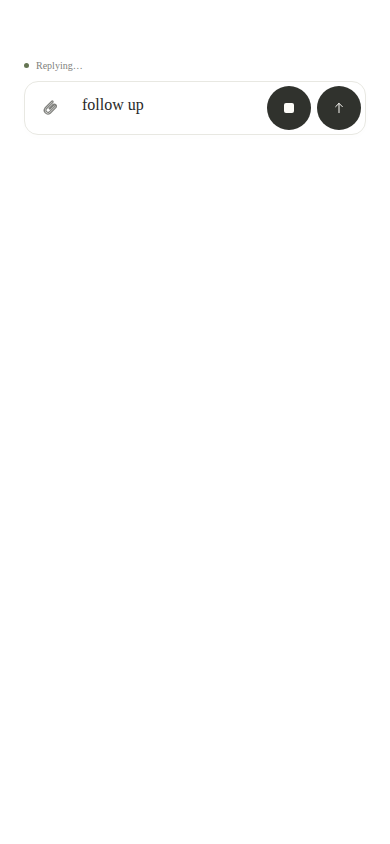
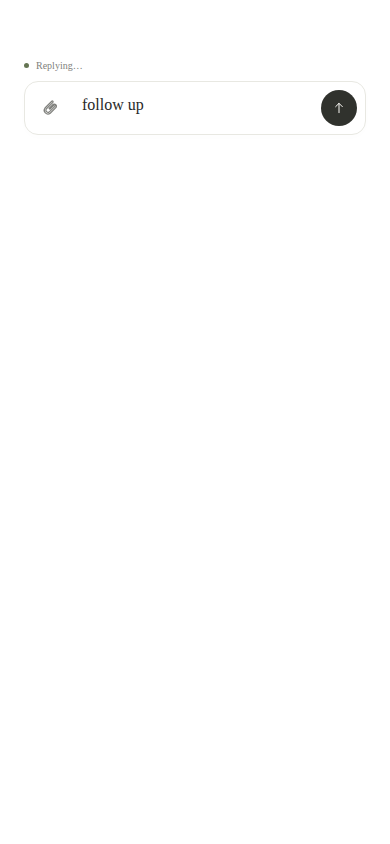
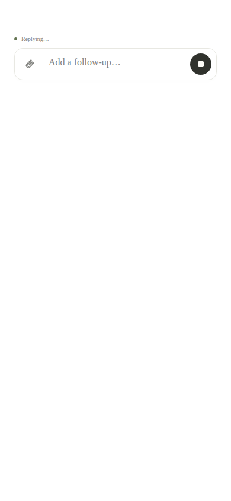

# Composer controls verification

Verified on 2026-09-08 in `feat/composer-controls`, based on `3f7bae2`.

## Behavior

During a running turn, non-whitespace message text shows only Send. Clearing the
draft, or successfully sending it, restores Stop if the turn is still running.
Whitespace uses the existing `trim()` semantics. Attachment-only drafts retain
both Send and Stop. Idle behavior, upload/loading/submission guards, failed-send
draft retention, and edits made while sending are preserved.

At widths up to 700px, Send and Stop have 36px visible circles inside 44px touch
targets. Desktop remains 28px. Accessible names and native keyboard activation
remain intact.

## Verification record

The original PR passed 138 regression tests, lint, typecheck, production app/CLI
builds, and production-auth smoke. Tests used bundled Node 24, pnpm 9.15.0,
process-local umask 022, and removed inherited Codex/Nitro overrides.

The isolated real-component browser fixture passed on desktop, mobile touch, and
standalone JavaScript emulation: text/empty/whitespace transitions, send/stop
callbacks, failed-send retention, pending-send edits, upload guards, attachment
payloads, keyboard/touch activation, and 44px mobile targets with 36px circles.

Disposable capture/test scripts, their fixture, package commands, and the unused
Playwright development dependency were removed during release integration.
The [historical revision](https://github.com/srctl/roost/tree/104becfb36cb03c8de3e7db491611e7575f8510c)
retains them for auditing these captures. Local ignored copies passed again on
the combined release candidate; see [integration verification](../../release-0.1.39-evidence/README.md).

## Matched BEFORE / AFTER fixture evidence

These are actual browser screenshots, not mockups. The same
`tests/fixtures/composer` layout and unchanged shared styles/components render:

- **BEFORE:** composer source from `3f7bae287253e1c4c5449ea78521b2fcc072152d`.
- **AFTER:** composer source from `47e0eaae9ad0733f3196cc92d2709f39b240a81f`.

The capture script loads the exact source using `git show` and a Vite module-load
plugin; it never rewrites the implementation or switches another worktree.
Each pair uses the same viewport (desktop 1280×844, mobile 390×844), device scale
factor 1, light color scheme, reduced motion, unfocused input, and pointer away
from controls. Both states have a running turn, no attachments, and no pending
upload/send. The text state contains exactly `follow up`; the empty state is
empty. These are mobile browser captures, not a physical iOS PWA.

| Matching viewport/state | BEFORE | AFTER |
| --- | --- | --- |
| Desktop 1280×844, running + text |  |  |
| Desktop 1280×844, running + empty |  |  |
| Mobile 390×844, running + text |  |  |
| Mobile 390×844, running + empty |  |  |

Result: all eight captures passed visibility and computed-dimension assertions,
with no browser page errors. All eight screenshots were visually inspected.
[Capture metadata](comparison/capture.json) records browser version, source
hashes, Git revisions, viewports, states, and measured button dimensions. Mobile
BEFORE circles are 44px; AFTER circles are 36px inside 44px touch targets. Desktop
controls remain 28px. Running + text changes from Stop and Send to only Send.

## Earlier current-state screenshots

Screenshots from the passing component fixture are retained beside this file.
They show the component in isolation; the surrounding page is not the full app.

| Mode | Send | Stop |
| --- | --- | --- |
| Desktop | [Send](desktop-Send.png) | [Stop](desktop-Stop.png) |
| Mobile | [Send](mobile-Send.png) | [Stop](mobile-Stop.png) |
| Standalone JS emulation | [Send](standalone-Send.png) | [Stop](standalone-Stop.png) |

## Limits

No live agent or production conversation was used. Standalone checks emulate the
JavaScript `matchMedia` branch on a mobile viewport; they do not represent a
physical installed iOS PWA. Native keyboard animation, installed status-bar
behavior, and physical iOS verification remain untested.
