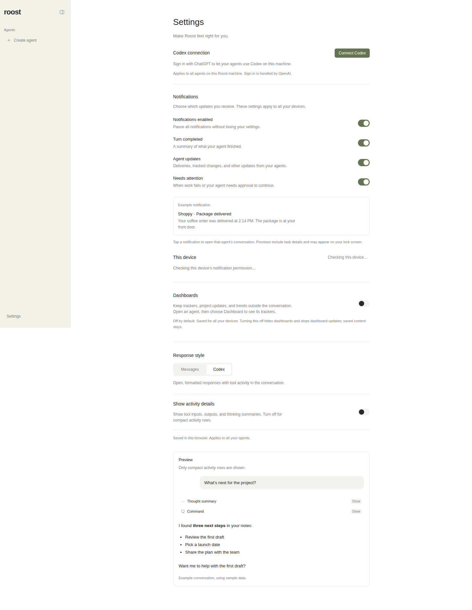
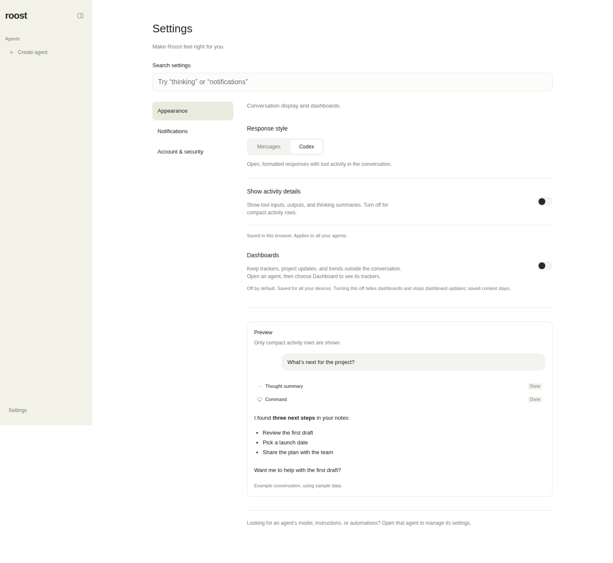
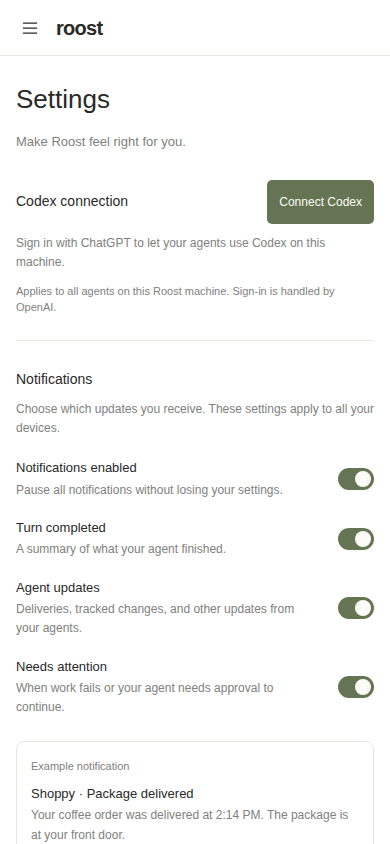
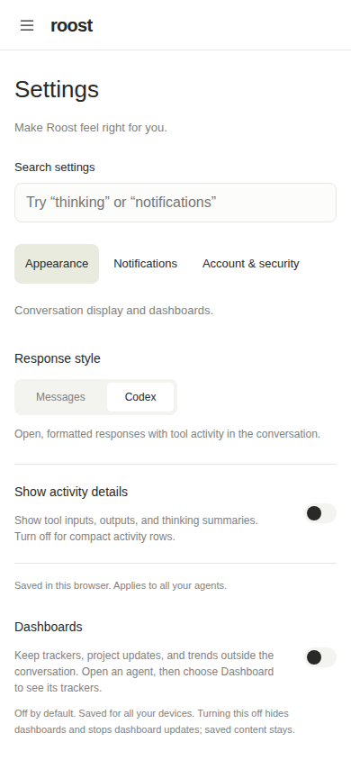
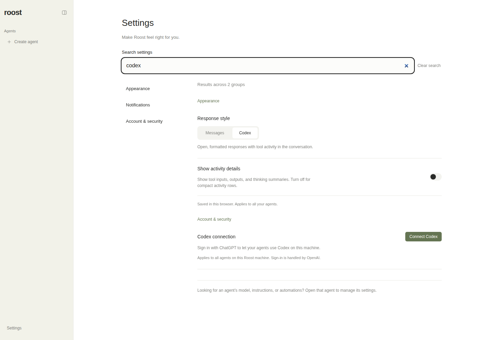
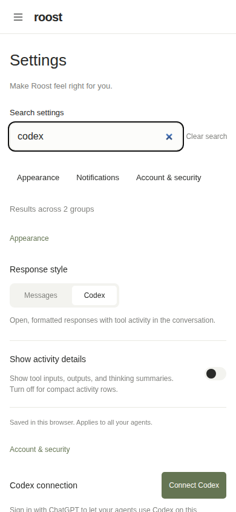

# Settings navigation

The previous `/settings` page placed passkeys, Codex connection, notifications,
dashboards, response style, activity details, and a large conversation preview in
one list. Agent identity, model, coding, and automation settings already live with
the agent; they stay there.

## Design decisions

- **Appearance:** response style, activity details, and dashboard visibility. The
  preview follows the controls, so it does not interrupt settings discovery.
- **Notifications:** global delivery preferences and this device's push setup stay
  together, including master-switch dependencies and permission explanations.
- **Account & security:** Codex connection and the existing authentication-gated
  link to passkeys and signed-in sessions. No authentication behavior changes.
- Search matches words in labels, group descriptions, and control vocabulary across
  every group. Search omits the large sample conversation so results stay compact.
  Related controls remain together to explain dependencies. Searching
  for thinking/activity while using Messages explains how to reveal those options.
  Empty results offer examples; Clear search and Escape restore the selected group.
- Group links use `?group=appearance|notifications|account`, support browser history
  and direct linking, and retain `/settings` as the default entry without redirecting.
  The conversation's Connect Codex link goes straight to Account & security.
- Hidden sections stay mounted to preserve in-flight state. Existing controls,
  persistence scope, errors, and permission checks remain in their components.

Assumption: this task concerns application-wide Settings. An always-visible hint
points people toward agent-specific settings without moving or duplicating them.
Three groups fit the current inventory; search is a small local index, with no new
library or server API. Keep the index updated when adding controls.

The layout follows Roost's existing StyleX tokens, Base UI controls, and 700px
responsive breakpoint. Standard links, a labeled search input, a result status,
and named regions follow [W3C landmark guidance](https://www.w3.org/WAI/WCAG22/Techniques/aria/ARIA11.html)
and [search landmark guidance](https://www.w3.org/WAI/ARIA/apg/patterns/landmarks/examples/search.html).
Groups sit beside content on desktop and wrap above it on mobile; group links have
44px targets and native keyboard focus indicators.

## Verification

`pnpm check` passes: lint, typecheck, 140 regression tests (including the new search
and group tests), app/CLI builds, production authentication smoke, six site tests,
and site typecheck/builds.

The prepared job inherits runtime overrides and umask 0077. The successful command
used a command-local umask 022 and removed `ROOST_CODEX_BINARY`, `NITRO_HOST`, and
`NITRO_PORT` for the test process. This prevents interference with mocked Herdr
calls, executable-file fixtures, and test-selected listener ports. No host settings
were changed. pnpm 9.15.0 was installed through npm because Corepack was unavailable.

Fresh Chromium profiles exercised the production build at 1440×1000, 390×844, and
320×740: keyboard group activation, direct links and back/forward, cross-group
search, conditional activity guidance, empty results, Clear/Escape focus, invalid
group fallback, notification dependencies, and notification/dashboard/display
persistence after reload. No horizontal overflow or uncaught browser errors.
Passkey-link visibility was checked with authentication disabled and an explicitly
mocked enabled-state response; the full production auth suite checks real local
enrollment, login, authorization, revocation, and recovery.

All UI runs used `/tmp/settings-navigation-data`, a nonexistent test Codex binary,
and loopback listeners. Live Roost data and browser credentials were not used.
Actual Codex sign-in and external push delivery were not exercised.

## Rendered evidence

Both captures show `/settings` at the top, with fresh browser defaults, Codex
response style, activity details off, dashboards off, no signed-in Codex account,
and authentication disabled. Desktop screenshots use full-page capture with the
same 1440×1000 viewport; mobile screenshots show the same 390×844 viewport (Roost
scrolls inside its mobile shell). Before is commit `3f7bae2`; after is this change.

| View | Before | After |
| --- | --- | --- |
| Desktop |  |  |
| Mobile |  |  |

Supplemental after-only search views demonstrate results spanning groups:

