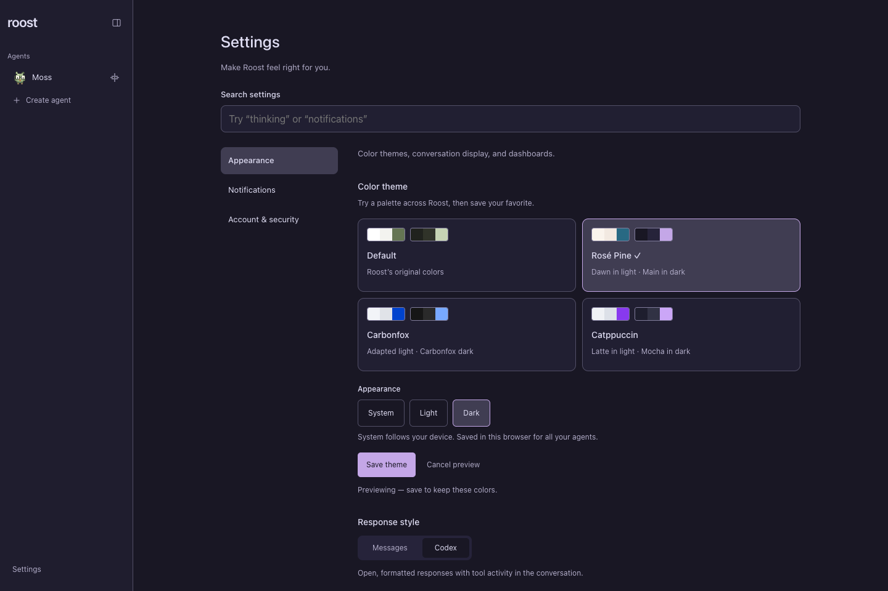

# Settings and appearance

Open **Settings** from navigation to adjust appearance, notifications, or your
account. Search settings by a control or theme name to find it across all groups.
**Clear search** or Escape returns to the selected group.

## Appearance

Under **Settings → Appearance → Color theme**, choose Default, Rosé Pine,
Carbonfox, or Catppuccin. Each offers **System**, **Light**, and **Dark** appearance.
System follows changes to your device's appearance while Roost is open.

Selecting a theme previews it across the app, including dialogs and dashboard
charts. Choose **Save theme** to keep it in this browser, or **Cancel preview**
to restore the saved choice. Leaving Settings or reloading also discards an
unsaved preview. Theme preferences are per browser, not shared across devices.
See [Custom color themes](custom-themes.md) for palette details.

**Response style** offers Messages for chat bubbles or Codex for open, formatted
responses and tool activity. Choose Codex to enable **Show activity details**
for expandable inputs, outputs, and available thinking summaries. These display
preferences do not change the model or its permissions.

Enable **Dashboards** here when you want agents to maintain saved trackers and
charts. Unlike appearance preferences, this setting applies to the installation
and all its devices. [Dashboards](dashboards.md) explains saved data and refreshes.

*Preview a palette before saving it to this browser. Real Roost interface with fictional sample data. Select the image for full size.*

## Notifications

**Settings → Notifications** contains the installation's notification switches
and this browser's push subscription. Enable each device separately. You can
choose turn completions, agent updates, and requests needing attention
independently. See [Push notifications](notifications.md).

## Account and security

Use **Settings → Account & security → Connect Codex** to connect the account
agents use. If native Roost login is enabled, this group also provides
**Manage passkeys and signed-in sessions**. Roost login and Codex login serve
different purposes; see [Passkey login](authentication.md).

To change an agent's identity, model, soul, memory, coding configuration, or
schedules, open that agent's settings from its header. These controls stay with
the owning agent.
