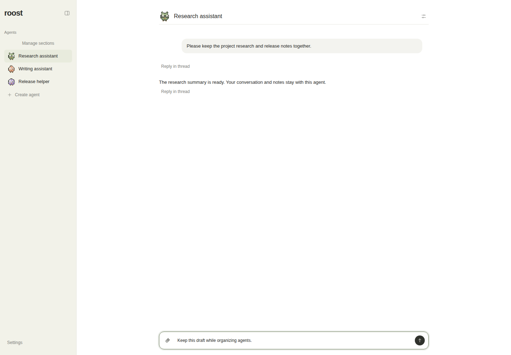
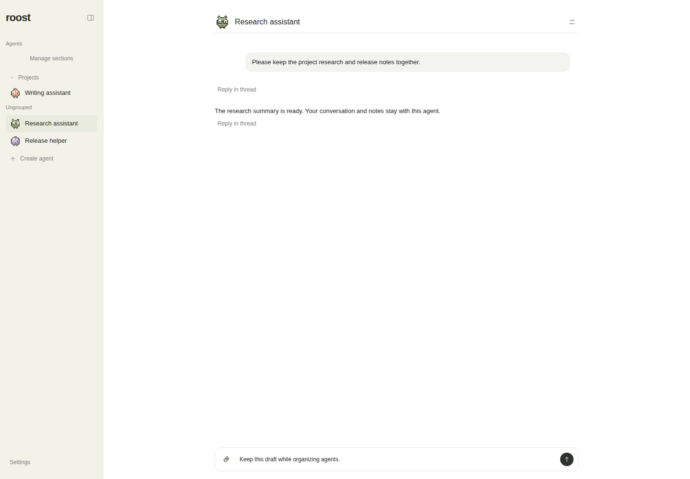
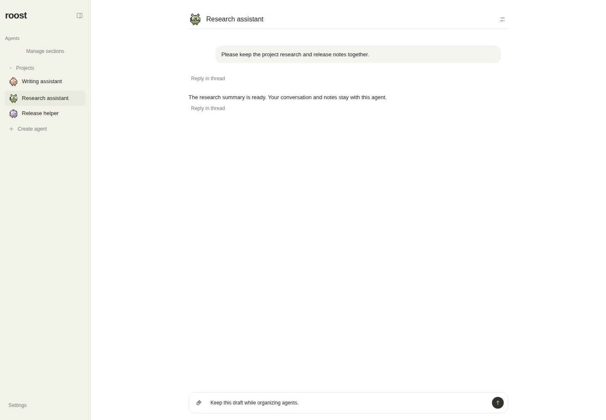
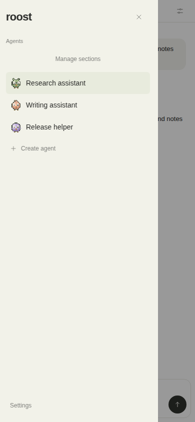
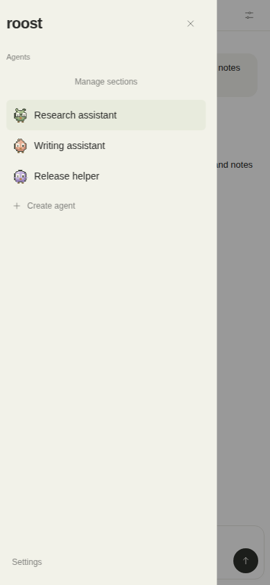
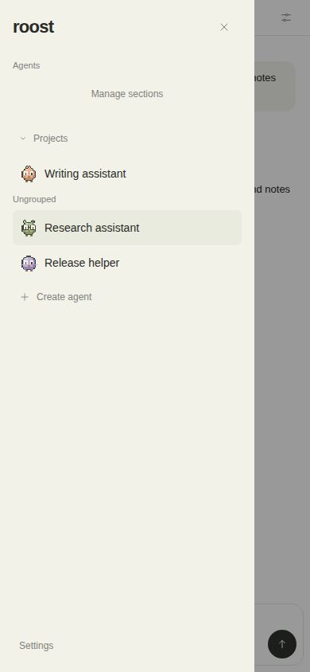
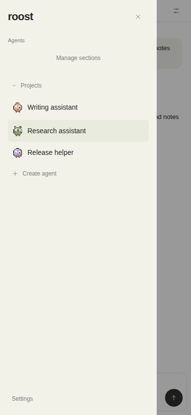

# Plain default navigation refinement

The default agent list has no Ungrouped heading, box or extra visual treatment, with zero sections or with created sections present. Only created sections have labels. The management select still offers Ungrouped.

Actual Chrome screenshots use the same fixture UUIDs, conversation content, active agent, draft, light theme and viewport before/after: desktop 1440x1000; mobile 390x844. Before is PR head 7ae52d9; after is the final pushed refinement head recorded in VERIFICATION.md. No live data used.

| State | Before | After |
| --- | --- | --- |
| Desktop, zero sections |  |  |
| Desktop, section present |  |  |
| Mobile, zero sections |  |  |
| Mobile, section present |  |  |
